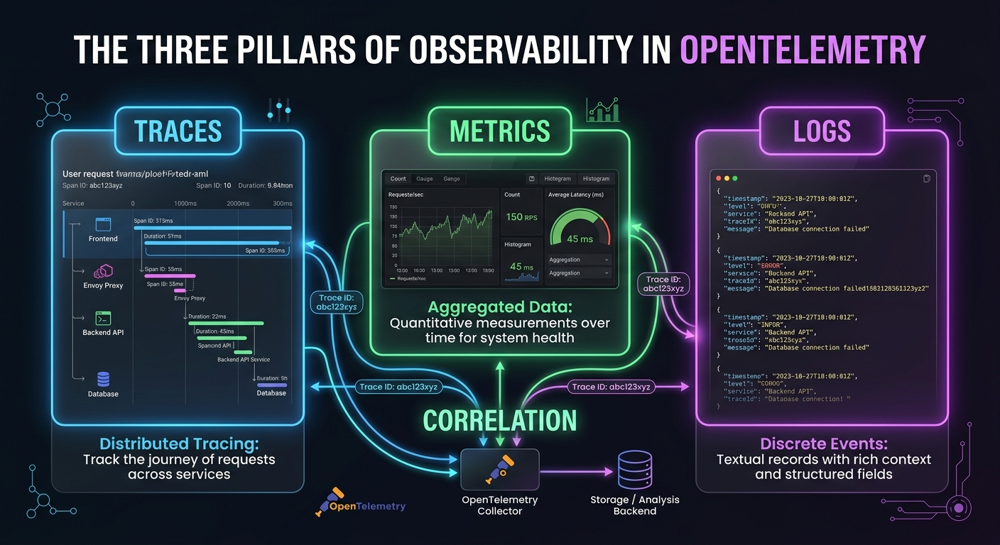
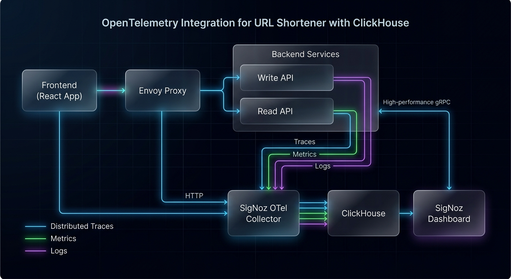
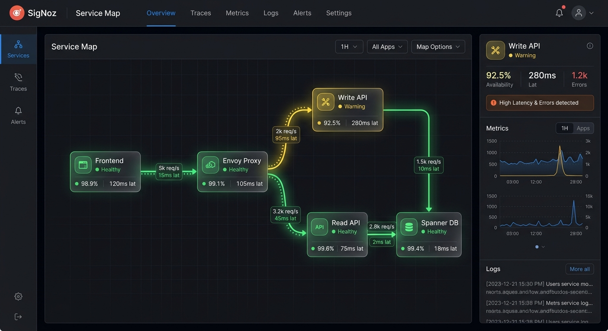
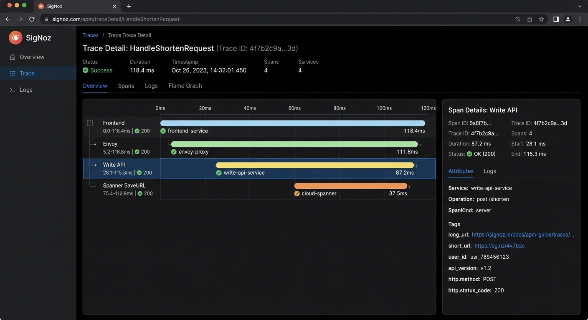
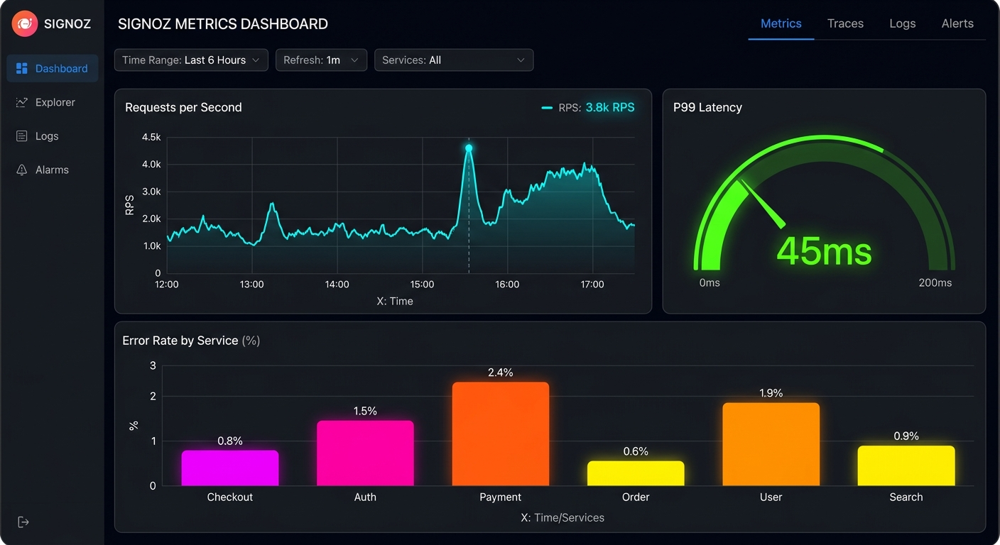
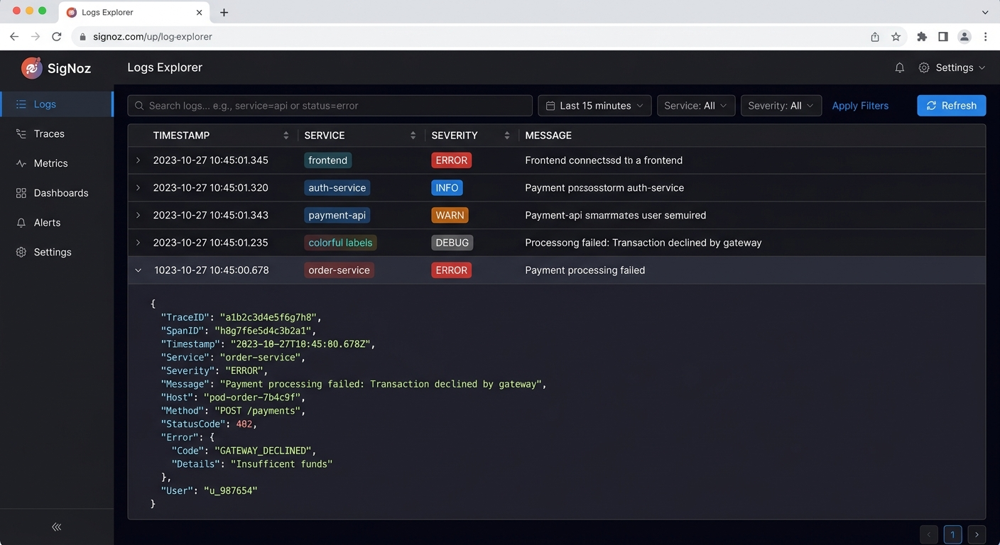

# Demystifying Observability with OpenTelemetry and SigNoz: A Practical Guide

In modern microservices architectures, understanding what happens inside your application is crucial. When a request fails or becomes slow, you need to know *why* and *where*. This is where **Observability** comes in, and **OpenTelemetry** (OTel) combined with **SigNoz** provides a powerful, open-source solution.

In this post, we'll use a **URL Shortener** application as a real-world example to explore how to implement distributed tracing, metrics, and logs.

---

## 💡 Core Concepts: The Three Pillars

Before diving into the code, let's understand the three pillars of observability that OpenTelemetry helps us capture:



1.  **Traces**: Track the journey of a single request as it traverses through various services (e.g., Frontend -> Envoy -> Backend API -> Database). Each step is called a **Span**.
2.  **Metrics**: Aggregated quantitative measurements over time (e.g., Requests per second, Error rate, CPU usage). Great for alerting and dashboards.
3.  **Logs**: Discrete, structured events with rich context (e.g., "Database connection failed").

**Correlation** is the superpower here. A log line can contain a `TraceID`, allowing you to jump from a slow metric graph to the exact trace, and then see the logs for that specific request.

---

## 🏗️ Architecture Overview

Here is how telemetry data flows in our URL Shortener application:



*   **Frontend (React)**: Emits traces for user interactions and API calls.
*   **Envoy Proxy**: Manages incoming traffic and routes frontend traces to the collector.
*   **Backend Services (Go)**: Emit traces, metrics, and logs for business logic execution.
*   **SigNoz OTel Collector**: A central receiver that processes and exports data.
*   **ClickHouse**: The high-performance columnar database where all traces, metrics, and logs are stored.
*   **SigNoz Dashboard**: The UI that reads from ClickHouse to visualize and query the data.


---

## 🛠️ Backend Instrumentation (Go)

Let's look at how we instrumented our Go backend services.

### 1. Initialization (`SetupOTel`)

We initialize the OpenTelemetry SDK to set up **Trace**, **Metric**, and **Log** providers. All of them export data via OTLP (OpenTelemetry Protocol) to the SigNoz Collector.

```go
// backend/shared/telemetry/otel.go

func SetupOTel(ctx context.Context, serviceName string) (func(context.Context) error, error) {
    res, _ := resource.New(ctx,
        resource.WithAttributes(
            semconv.ServiceNameKey.String(serviceName),
        ),
    )

    collectorAddr := "signoz-otel-collector:4317" // gRPC endpoint

    // 1. Trace Provider
    traceExporter, _ := otlptracegrpc.New(ctx, otlptracegrpc.WithEndpoint(collectorAddr), otlptracegrpc.WithInsecure())
    tp := sdktrace.NewTracerProvider(
        sdktrace.WithSampler(sdktrace.AlwaysSample()),
        sdktrace.WithBatcher(traceExporter),
        sdktrace.WithResource(res),
    )
    otel.SetTracerProvider(tp)

    // 2. Metric Provider
    metricExporter, _ := otlpmetricgrpc.New(ctx, otlpmetricgrpc.WithEndpoint(collectorAddr), otlpmetricgrpc.WithInsecure())
    mp := metric.NewMeterProvider(
        metric.WithReader(metric.NewPeriodicReader(metricExporter, metric.WithInterval(5*time.Second))),
        metric.WithResource(res),
    )
    otel.SetMeterProvider(mp)

    // 3. Log Provider
    logExporter, _ := otlploggrpc.New(ctx, otlploggrpc.WithEndpoint(collectorAddr), otlploggrpc.WithInsecure())
    lp := sdklog.NewLoggerProvider(sdklog.WithProcessor(sdklog.NewBatchProcessor(logExporter)), sdklog.WithResource(res))
    global.SetLoggerProvider(lp)

    return func(ctx context.Context) error {
        // Shutdown logic to flush data on exit
        return nil
    }, nil
}
```

### 2. Automatic HTTP Metrics (Middleware)

We use a middleware to automatically capture request count and duration for every HTTP endpoint.

```go
// backend/shared/telemetry/middleware.go

func MetricsMiddleware() fiber.Handler {
    meter := otel.Meter("http-metrics")
    requestsCounter, _ := meter.Int64Counter("http_requests_total")
    durationHistogram, _ := meter.Float64Histogram("http_request_duration_seconds")

    return func(c *fiber.Ctx) error {
        start := time.Now()
        err := c.Next()
        duration := time.Since(start).Seconds()

        attrs := []attribute.KeyValue{
            attribute.String("method", c.Method()),
            attribute.String("path", c.Route().Path),
            attribute.Int("status_code", c.Response().StatusCode()),
        }

        requestsCounter.Add(c.UserContext(), 1, metric.WithAttributes(attrs...))
        durationHistogram.Record(c.UserContext(), duration, metric.WithAttributes(attrs...))

        return err
    }
}
```

### 3. Custom Spans & Attributes

Inside our handlers, we create custom spans to track specific operations and add business-relevant attributes.

```go
// backend/write-service/internal/api/handler.go

func (h *Handler) HandleShortenRequest(c *fiber.Ctx) error {
    // 1. Start a Span
    ctx, span := h.tracer.Start(c.UserContext(), "HandleShortenRequest")
    defer span.End()

    // 2. Add Attributes (Context)
    span.SetAttributes(attribute.String("long_url", req.LongURL))

    // ... business logic ...

    if err != nil {
        // 3. Record Errors
        span.RecordError(err)
        span.SetStatus(codes.Error, "spanner_insert_failed")
        
        // 4. Increment Custom Metrics
        h.errorCounter.Add(ctx, 1, metric.WithAttributes(attribute.String("reason", "spanner_insert_failed")))
        return c.Status(500).JSON(fiber.Map{"error": "Internal server error"})
    }

    // 5. Structured Logging
    var record otellog.Record
    record.SetBody(otellog.StringValue("URL Shortened Successfully"))
    record.SetSeverity(otellog.SeverityInfo)
    h.logger.Emit(ctx, record)

    return c.Status(201).JSON(...)
}
```

---

## 🌐 Frontend Instrumentation (React)

For the frontend, we use the OpenTelemetry Web SDK to capture user interactions and document load times.

```javascript
// frontend/src/telemetry.js

import { WebTracerProvider, BatchSpanProcessor } from '@opentelemetry/sdk-trace-web';
import { OTLPTraceExporter } from '@opentelemetry/exporter-trace-otlp-http';
import { registerInstrumentations } from '@opentelemetry/instrumentation';
import { DocumentLoadInstrumentation } from '@opentelemetry/instrumentation-document-load';
import { FetchInstrumentation } from '@opentelemetry/instrumentation-fetch';

const exporter = new OTLPTraceExporter({
  url: '/v1/traces', // Relative URL, routed by Envoy to SigNoz
});

const provider = new WebTracerProvider({
  resource: resourceFromAttributes({
    [SemanticResourceAttributes.SERVICE_NAME]: 'frontend',
  }),
  spanProcessors: [new BatchSpanProcessor(exporter)],
});

provider.register();

// Auto-instrument common events
registerInstrumentations({
  instrumentations: [
    new DocumentLoadInstrumentation(),
    new FetchInstrumentation(),
  ],
});
```

### 🚨 Global Error Capture

We also listen for unhandled errors and report them as spans so they appear in SigNoz.

```javascript
window.addEventListener('error', (event) => {
  const span = tracer.startSpan('unhandled-error');
  span.setStatus({ code: 2, message: event.message }); // 2 = Error
  span.setAttribute('error.message', event.message);
  span.end();
});
```

---

## 📊 Visualizing in SigNoz

SigNoz provides a unified dashboard to visualize all your telemetry data. Let's explore the key features and how to use them.

> [!NOTE]
> The images in this section are **conceptual illustrations** designed to highlight key features. Since the deployment uses the latest SigNoz images (via `:latest` tags), the actual UI layout and colors may vary slightly in your installation.


### 1. Service Map (Dependency Graph)

The **Service Map** automatically discovers and visualizes the topology of your application. It shows how services interact and their health status.



*   **What it shows**:
    *   Nodes representing services (Frontend, Envoy, Write API, etc.) and databases (Spanner, Redis).
    *   Edges showing request flow with **RPS** (Requests Per Second) and **Latency**.
    *   Color-coded health status (Green = Healthy, Yellow/Red = High Error Rate or Latency).
*   **How to use it**:
    *   **Identify Bottlenecks**: Look for red/yellow nodes or edges with high latency numbers.
    *   **Understand Dependencies**: See which service is calling which, helping isolate issues in complex call chains.

---

### 2. Distributed Tracing (Waterfall View)

Distributed Tracing tracks a single request across all service boundaries.



*   **What it shows**:
    *   A **Waterfall Chart** of Spans representing the execution time of each operation.
    *   **Span Details**: Clicking a span reveals attributes like `long_url`, `user_id`, HTTP method, and status code.
    *   **Error Indicators**: Spans with errors are clearly marked, showing where the failure occurred.
*   **How to use it**:
    *   **Debug Slow Requests**: Find the longest span in the waterfall to identify the slow component (e.g., a database query or external API call).
    *   **Root Cause Analysis**: Inspect error spans to see the exact error message and stack trace.

---

### 3. Metrics & Custom Dashboards

Metrics give you a high-level view of system health and performance trends.



*   **What it shows**:
    *   **Out-of-the-box Metrics**: RPS, 50th/90th/99th percentile Latency, and Error Rate for every service.
    *   **Custom Panels**: Graphs for custom metrics like `shorten_requests_total` or `http_request_duration_seconds`.
*   **How to use it**:
    *   **Monitor Trends**: Watch for sudden spikes in error rates or latency.
    *   **Correlate with Traces**: Click on a spike in a metric graph to jump directly to the traces that occurred during that time window.

---

### 4. Log Management & Correlation

SigNoz aggregates logs and correlates them with traces for seamless debugging.



*   **What it shows**:
    *   A searchable stream of logs from all services.
    *   **Structured Attributes**: Logs parsed into JSON fields (Timestamp, Service, Severity, Message).
    *   **Trace ID Correlation**: Logs emitted during a trace include the `TraceID`.
*   **How to use it**:
    *   **Filter and Search**: Search for specific error messages or filter by service and severity.
    *   **Jump from Trace to Log**: When viewing a trace, you can see all logs emitted by that specific request, providing full context without searching.

---

## ☁️ Moving to the Cloud: SigNoz Cloud & GCP

While running SigNoz locally or on-premise is great for control, **SigNoz Cloud** (SaaS) offers a fully managed experience, reducing operational overhead.

If you are running your application on **Google Cloud Platform (GCP)** (e.g., Google Kubernetes Engine - GKE), you have two main options:

### Option 1: Use SigNoz Cloud (SaaS)

To send telemetry from your GCP workloads to SigNoz Cloud, you only need to update your configuration to point to the SigNoz Cloud ingestion endpoint.

#### 1. Configuration Changes

You need to set the endpoint and provide an **Ingestion Key** via headers.

**Using Environment Variables:**

```bash
# Set the endpoint (replace {region} with your SigNoz region, e.g., us, in)
export OTEL_EXPORTER_OTLP_ENDPOINT="https://ingest.{region}.signoz.cloud:443"

# Set the authentication header
export OTEL_EXPORTER_OTLP_HEADERS="signoz-ingestion-key=<your-signoz-ingestion-key>"
```

**Updating Go Code (`SetupOTel`):**

If you are configuring it in code, you can use `WithHeaders` in the exporter options.

```go
// Example update for SigNoz Cloud in Go
traceExporter, _ := otlptracegrpc.New(ctx,
    otlptracegrpc.WithEndpoint("ingest.us.signoz.cloud:443"), // Example US region
    otlptracegrpc.WithHeaders(map[string]string{
        "signoz-ingestion-key": "<your-ingestion-key>",
    }),
)
```

---

### Option 2: Self-Host on GCP (GKE)

If you prefer to keep your data within your GCP project for compliance or cost reasons, you can deploy SigNoz on **Google Kubernetes Engine (GKE)**.

1.  **Provision a GKE Cluster**: Create a node pool with sufficient resources (ClickHouse requires good I/O and memory).
2.  **Deploy via Helm**: SigNoz provides a Helm chart for easy deployment.
    ```bash
    helm repo add signoz https://signoz.github.io/helm-charts
    helm install my-release signoz/signoz --set clickhouse.persistence.storageClass=premium-rwo
    ```
    *Tip: Use GCP's `premium-rwo` (SSD) storage class for ClickHouse for optimal performance.*

---

By integrating OpenTelemetry and SigNoz, we gain complete visibility into our application, making debugging faster and system behavior predictable.
