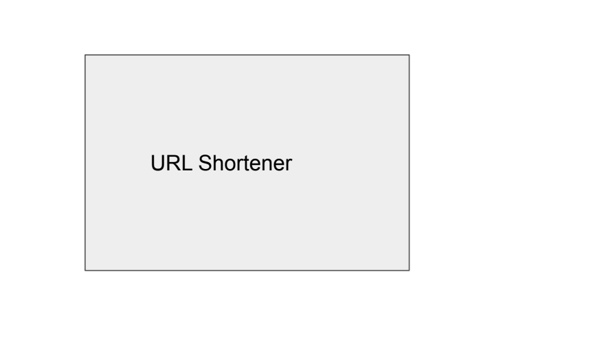

# Step 1: 
## a. Collect functional requirement
- Given a URL, our service should generate a shorter and unique alias of it.
- When users access a short link, our service should redirect them to the original link.
- Users should optionally be able to pick a custom short link for their URL.
- Links will expire after a standard default timespan. Users should be able to specify the expiration time.
- Analytics; e.g., how many times a redirection happened?
- Our service should also be accessible through REST APIs by other services.
- The system should be highly available. This is required because, if our service is down, all the URL redirections will start failing.
- URL redirection should happen in real-time with minimal latency.
- Shortened links should not be guessable (not predictable).
## b. Collect design constraints
### Short URL
- The size of the short url: let's start with 7
- Character set: A-Z, a-z, 0-9
- The rate of generation of URL?
- The rate of retrieval of URL?
- TTL?

# Step 2:
## a. Bucketize functional requirements into micro services
- A single micro service

## b. Get clarity weather problem is breadth-oriented or depth-oriented
- Depth oriented

# Step 3:
## a. Draw a logical diagram

## b. Draw and explain data/logic flow between them
NA

# Step 4:
## a. Micro service to focus for URL shorter
### Tiers: 
- App 
- Cache
- Storage
### Data model
- Key value pair K,V
- Short URL of unique integer : K = Long URL + TTL + creation time
- Key value pair for user
URL
- url_key
- original_url
- createdAt
- expireAt
- userId
User
- userId
- name
- email
- cratedAt
- lastLogin
- password
### API
- create(longURL)
    - Go directly to storage and assign a unique id to the record
    - Store K-V pair: unique id - longURL in storage
    - Write around K-V in cache
    - Convert unique id to 7 character short URL
- read(shortURL)
    - convert short URL into unique id
    - Lookup in cache for unique id
    - if cache miss then go to storage and write around
- Conversion algo
    - Convert a unique integer to 7 character long string
    - 62 options and 7 positions = 62^7 ~ 2^42 = 4 trillion
    - Base 62 encoding
    - Let's take number 65 = 0*62^6 + 1*62 + 3*1 = 0000013 = AAAAABD
    - A-Z: 0-25, a-z: 26 - 51, 0-9: 52-61
    - AAAAABD = 0000013 = 65    
### How to store in memory?
- Hashmap
### How to store in storage?
- Row storage
## b. Each micro services consists of one of more tiers
### Capacity
- Active users per month = 500 million
- Read vs Write ratio = 100:1
- Object size = 1 kb
- Request made by each users in month to create new url = 2 to 5 ~= 5
- If we follow the 80-20 rule, meaning 20% of URLs generate 80% of traffic, we would like to cache these 20% hot URLs.

### Traffic estimate
Estimated request per month = 500 * 5 million = 2.5 billion

Write request per seconds = 2500 million / (30 days * 24 hours * 60 mins * 60 seconds) ~= 1000 URLs/second ~= 1k per second

Total read per month= 2.5 * 100 billion = 250 billion

Read per second = 1k * 100 ~= 100k urls per second

### Storage estimate
Total number of objects in 5 years = 2.5 billion * 12 months * 5 years = 150 billion

Total storage = 150 billion * 1 kb = 150 million mb = 150 k gb = 150tb

### Network bandwidth 
Write (incoming) request per second = 1000 per seconds
Size per request = 1kb
Write (incoming) network bandwidth = 1000kb per second = 1mb per second

Read (out going) request per second = 100mb per second

Total network bandwidth = 100mb + 1mb ~= 100mb

### Memory estimates
Read request per second = 100k urls per second
Read request per day = 100k * 24 * 60 * 60 = 8640000 k = 8640 million = 8.6 billion 
To cache 20% of request = 8.6 billion * 0.20 = 1.72 billion
Size of cache request = 1.720 billion * 1 kb = 1720GB

## c. Build scalable system
### Sharding
- Horizontal range
    - 1TB each
    - 150 shards
    - replicator factor of 3
- create(longUrl)
    - Request goes to any app server
    - Request goes to storage tier distributed system
    - LB/Router in storage tier choose any shard and send request to the server
    - Storage server assigns unique id
    - Populate cache tier with K/V
        - Based on unique id, LB/Router of cache tier sends to appropriate server
    - App server does conversion
- read(shortUrl)
    - REad goes to any app server
    - App server does conversion
    - Cache tier is called to lookup based on unique id 
    - Based on unique id, LB/Router of cache tier sends to appropriate server
    - if cache miss then storage tier is cached
    - LB/router select shard based on unique id
    - 