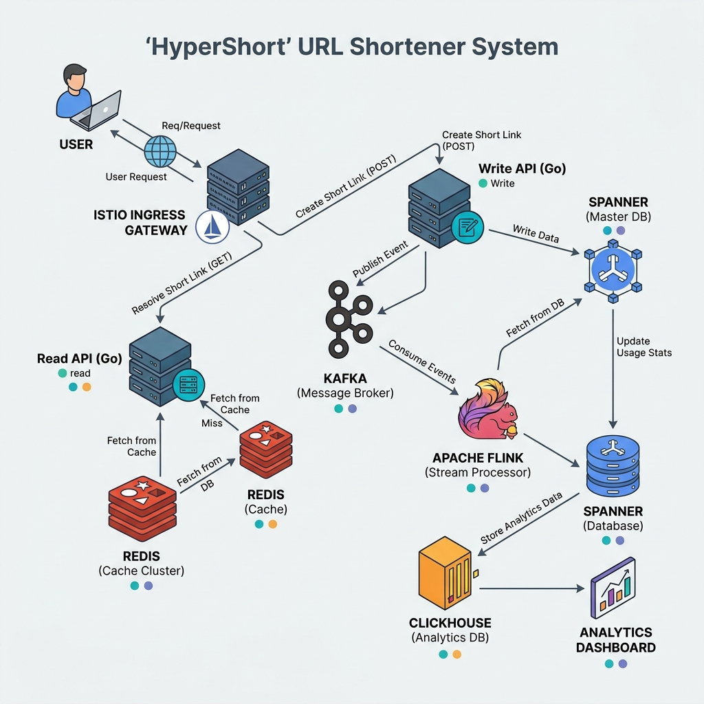

# HyperShort: High-Performance URL Shortener

HyperShort is a production-ready URL shortener system built with a modern stack, focusing on high performance, scalability, and observability.

## System Architecture

The system is designed with a clear separation between write and read paths to optimize for both high-throughput shortening and low-latency redirects.

## Architecture



### Sequence Diagram


## Envoy Architecture (API Gateway)

The system uses two separate **Envoy** instances to achieve **Traffic Isolation** and **Performance Optimization**.

| Feature | `envoy` (Main) | `envoy-read` (Read) |
| :--- | :--- | :--- |
| **Primary Target** | `write-api`, `analytics-api`, `frontend` | `read-api` |
| **Route Match** | `/api/v1/*`, `/` | `^/[a-zA-Z0-9-_]+$` (Short Code) |
| **Authentication** | Yes (JWT via Google) | No |
| **CORS** | Yes | No |
| **Local Rate Limit** | 100 req/sec | 1000 req/sec |
| **Global Rate Limit**| 500 req/sec | 5000 req/sec |
| **Connect Timeout**| 5s | 0.25s |

### Why Two Envoys?
1. **Traffic Isolation**: High-volume redirect traffic (clicks) is isolated from management traffic (creating links, viewing dashboards).
2. **Performance**: The `envoy-read` instance is stripped of Auth and CORS overhead, allowing ultra-fast routing with aggressive timeouts.
3. **Independent Scaling**: Read and Write gateways can be scaled independently based on load.

### Rate Limiting Strategy
The system employs a **defense-in-depth** rate limiting strategy to support multi-datacenter deployments:
1.  **Local Rate Limiting**: Enforced independently by each Envoy instance using a token bucket. This protects the local node from sudden bursts.
2.  **Global Rate Limiting**: Enforced across all datacenters using an external gRPC Rate Limit Service backed by a **dedicated Redis instance** (`redis-ratelimit`). This isolates rate limiting state from the application cache and protects backend databases (Spanner, ClickHouse) from exceeding aggregate capacity.

## Core Components

### 1. Write Service (`write-api`)
Handles the synchronous path for creating short URLs.
- **ID Generation**: Uses a Feistel cipher to obfuscate sequential IDs, preventing short URL guessing.
- **Persistence**: Saves the mapping `(id, long_url)` to Google Cloud Spanner.
- **Cache Management**: Synchronously warms the Redis cache on creation/update and invalidates on delete to maintain consistency.
- **Async Tasks**: Emits a `url-created` event to Kafka for downstream processing.

### 2. Read Service (`read-api`)
Optimized for low-latency redirects.
- **Multi-Layer Lookup**: Checks Bloom Filter guard first, then Redis cache, and falls back to Spanner for stale reads.
- **Cache Stampede Prevention**: Uses `singleflight` to collapse concurrent requests for the same short code during cache misses.
- **Dynamic Updates**: Uses `302 Found` redirects with `Cache-Control: no-store` to prevent browser caching, ensuring edits take effect immediately.
- **Resilience**: Implements a "Fail-Open" strategy to ensure redirects work even if non-critical components (Redis, Bloom) are down.
- **Analytics**: Emits `click-event` to Kafka for every successful redirect.

### 3. Analytics Service
Processes and serves real-time link performance data.
- **Stream Processing**: Uses **Apache Flink** to consume `click-event` from Kafka and sink them into ClickHouse with exactly-once semantics.
- **OLAP Storage**: Leverages **ClickHouse** for high-performance aggregations and Materialized Views.
- **API**: Provides high-performance querying of ClickHouse for the top-performing links dashboard, enriched with metadata from Spanner.

### 4. Frontend
A modern React application built with **Tailwind CSS** and **Shadcn UI**.
- **Real-time Updates**: Uses `react-query` for efficient data fetching and caching (5s refetch interval).
- **Responsive Design**: Fully responsive UI for shortening URLs and viewing analytics.

## Key Features

### Dynamic Domain Support
The system supports a dynamic base URL for shortened links, configured via the `SHORT_LINK_BASE_URL` environment variable. This allows the system to generate links that match the environment (e.g., `localhost:10001` for local dev, `sho.rt` for production).

## Observability (OpenTelemetry & SigNoz)

The system is fully instrumented with **OpenTelemetry** for distributed tracing, metrics, and logging.

> [!NOTE]
> **SigNoz Infrastructure**: SigNoz runs with a single-node ClickHouse cluster and a dedicated **ZooKeeper** instance to support schema migrations and distributed operations.

### Metrics Covered
We track several key performance indicators (KPIs) across the system:

| Metric Name | Description | Type |
|-------------|-------------|------|
| `shorten_requests_total` | Total number of URL shortening requests | Counter |
| `shorten_errors_total` | Total number of errors during shortening | Counter |
| `redirect_requests_total` | Total number of redirect requests | Counter |
| `cache_hits_total` | Number of successful Redis cache lookups | Counter |
| `cache_misses_total` | Number of Redis cache misses | Counter |


### Accessing SigNoz UI

SigNoz provides a unified dashboard for all telemetry data (Traces, Metrics, Logs).

#### 1. Verify SigNoz is Running
Before accessing the UI, ensure all SigNoz components are ready:
```bash
kubectl get pods -l 'app in (signoz-frontend, signoz-query-service, signoz-clickhouse, signoz-otel-collector, signoz-zookeeper)'
```
*All pods should be in `Running` state.*

#### 2. Port-Forward Frontend
`run.sh` automatically port-forwards the SigNoz frontend. If you need to do it manually:
```bash
kubectl port-forward svc/signoz-frontend 3301:3301
```

#### 3. Access the Dashboard
Open your browser and navigate to:
[http://localhost:3301](http://localhost:3301)

> [!NOTE]
> **First-time Setup**: On your first visit, SigNoz will prompt you to create an admin account.

#### Resetting Admin Account

If you are prompted for an invitation or need to reset the admin account, you can restart the `signoz-query-service` pod to clear the ephemeral database:

```bash
export KUBECONFIG=$HOME/.kube/kind-url-shortener
kubectl rollout restart deployment/signoz-query-service
```
This will allow you to create a new admin account on the next visit.

## Getting Started

1. **Launch Cluster**: `./run.sh` (Creates Kind cluster and deploys all services)
2. **Verify**: `./test.sh` (Runs integration tests)
3. **Cleanup**: `./destroy.sh` (Deletes cluster)
