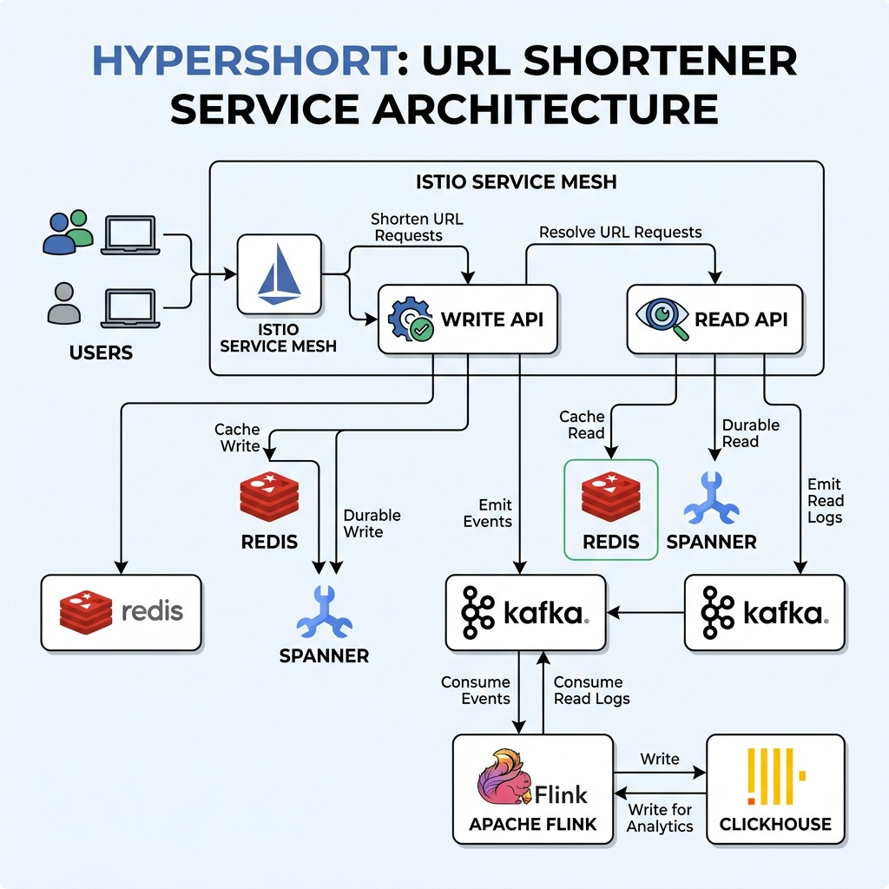
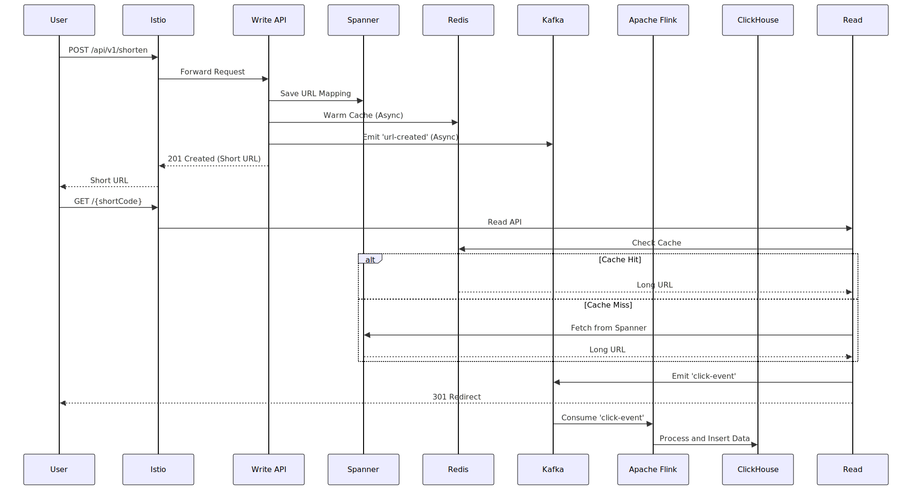

# URL Shortener Read Service

The Read Service is a high-performance, stateless application responsible for resolving short codes into long URLs and issuing redirects.

## Features

- **High Throughput**: Designed to handle 38,500+ RPS.
- **Multi-Layered Cache**: Uses Redis and Bloom filters to protect the primary database.
- **Stale Reads**: Leverages Spanner stale reads for sub-10ms latency.
- **Fail-Open Resilience**: Gracefully handles Redis failures by falling back to Spanner.
- **Async Analytics**: Non-blocking click event emission to Kafka.

## Architecture

The service follows a strict cache-aside pattern with a Bloom filter guard to prevent cache penetration attacks.



### Sequence Diagram



## API Usage

### Resolve Short URL
`GET /{short_code}`

**Request:**
```bash
curl -i http://localhost:10001/abcde123
```

**Response:**
```
HTTP/1.1 302 Found
Location: https://www.google.com
Cache-Control: no-store, no-cache, must-revalidate, proxy-revalidate
Content-Length: 0
Date: Sat, 14 Mar 2026 13:55:39 GMT
```

## Implementation Details

- **Istio Service Mesh**: Validates short code format and enforces rate limits.
- **Redis**: Primary cache lookup for sub-millisecond response times.
- **Bloom Filter**: Secondary guard to prevent unnecessary database queries for non-existent keys.
- **Singleflight**: Prevents cache stampede by collapsing concurrent requests for the same short code during cache misses.
- **Spanner**: Stale read (15s) as the final source of truth, providing high availability and low latency.
- **Dynamic Updates**: Uses `302 Found` with `Cache-Control: no-store` to prevent browser caching, ensuring edits take effect immediately.
- **Kafka**: Asynchronous click event emission for real-time analytics.

## Deployment Strategy

### Docker
The service is containerized using a multi-stage Dockerfile to ensure minimal image size.
- `cmd/read-api/Dockerfile`

### Kubernetes
Manifests are organized into subdirectories:
- `k8s/istio/`: Istio Service Mesh configurations (Gateways, VirtualServices).
- `k8s/read-api/`: Stateless Read API service.

## Local Development & Testing

### Launch Setup
```bash
./run.sh
```

### Run Verification
```bash
./test.sh
```

### Cleanup
```bash
./destroy.sh
```
