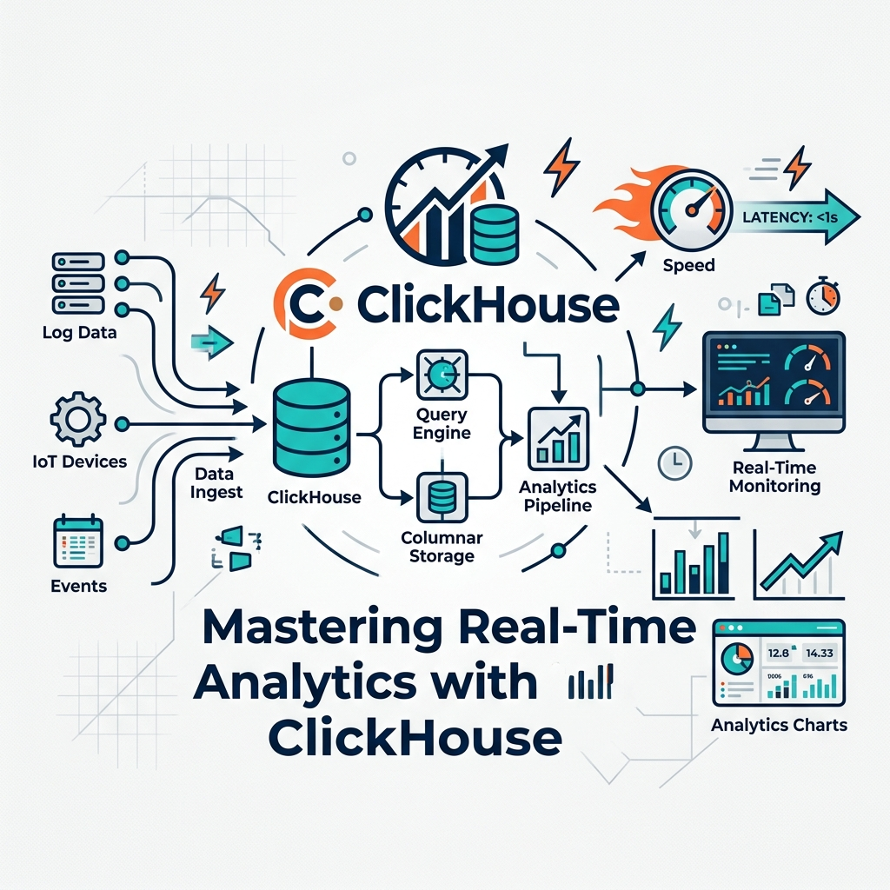

# Mastering Real-Time Analytics with ClickHouse: A Deep Dive

In the world of high-performance systems, understanding user behavior in real-time is crucial. For a high-scale **URL Shortener** system, for example, one might need a database that can handle massive write throughput of click events and provide instant, aggregated insights. Enter **ClickHouse**.

In this blog post, we'll explore what ClickHouse is, why it's a game-changer for OLAP (Online Analytical Processing) workloads, how it compares to other real-time OLAP engines, and how it can be leveraged in a real-world scenario like URL shortener analytics.

---

## Why an OLAP Database?

Before diving into ClickHouse, let's understand why we need a specialized database category called **OLAP** (Online Analytical Processing) for a project like a real-time URL shortener.

### OLTP vs OLAP

Traditional applications typically use **OLTP** (Online Transactional Processing) databases like PostgreSQL, MySQL, or a globally distributed database like Cloud Spanner. These databases are optimized for handling high volumes of fast, simple operations: inserts, updates, and lookups on individual rows (e.g., retrieving the long URL for a short code).

However, analytics require a different approach. We are not interested in a single click, but in trends across millions of clicks: "What are the top 10 links today?", "Where are the users coming from?". This is where **OLAP** databases shine. They are designed to query massive datasets and perform aggregations instantly.

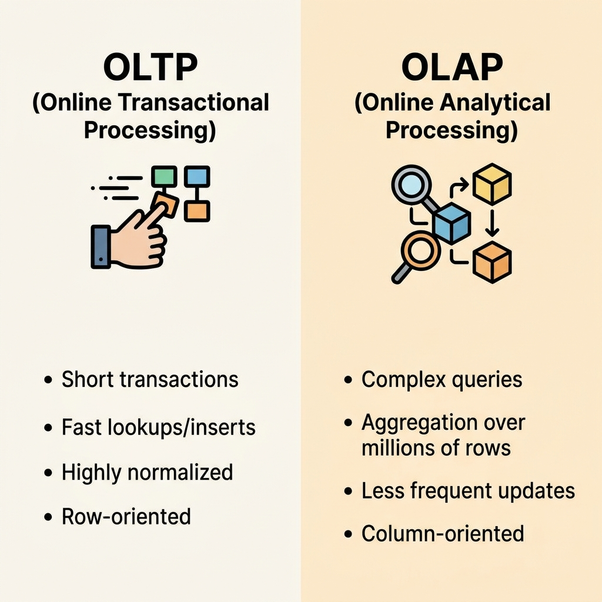

### Why not use NoSQL or our existing OLTP database for analytics?
- **OLTP Database (e.g., Cloud Spanner)**: While an OLTP database is excellent for core functionality, using it for heavy aggregation queries would compete for resources with the read/write workload, slowing down the system.
- **NoSQL (Key-Value/Document)**: Databases like Redis or MongoDB are great for fast lookups but are not optimized for large-scale analytical queries involving complex aggregations over time.

In a typical implementation, we use a transactional database for core operations and ClickHouse for analytics. This separation ensures that the system remains both fast and analytical.

---

## What is ClickHouse?

ClickHouse is an open-source, high-performance, column-oriented SQL database management system for online analytical processing (OLAP). It was originally developed by Yandex for web analytics traffic analysis and is now maintained by ClickHouse, Inc.

Unlike traditional row-oriented databases (like PostgreSQL or MySQL), ClickHouse stores data in columns. This architectural difference allows for insanely fast execution of analytical queries on massive datasets.

### Row-Oriented vs Columnar Storage

To understand why ClickHouse is so fast, let's compare how data is stored.

Imagine a table with `event_time`, `short_code`, and `country_code` columns.

- **Row-Oriented**: Stores data row by row. To find all clicks for a specific `short_code`, a row-oriented database must read all columns for all rows from disk, even if it only needs the `short_code` and a count.
- **Columnar**: Stores data column by column. ClickHouse only reads the columns required for the query, significantly reducing I/O operations.

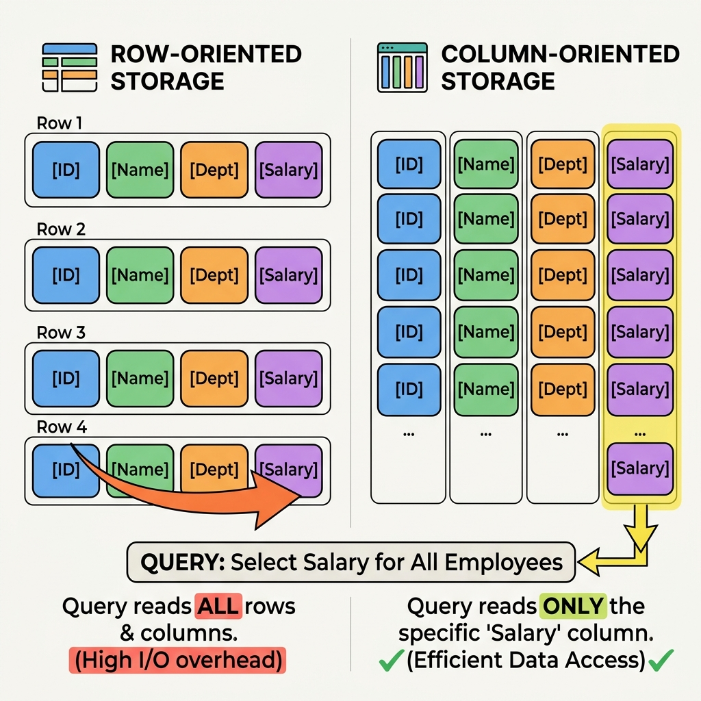

---

## Core Features of ClickHouse

### 1. The MergeTree Engine Family
The `MergeTree` engine family is the heart of ClickHouse storage. It organizes data by primary key, automatically merges parts in the background, and supports sparse indexes.
We use special variants like `SummingMergeTree` and `AggregatingMergeTree` for pre-aggregating data, which we'll see in our URL shortener example.

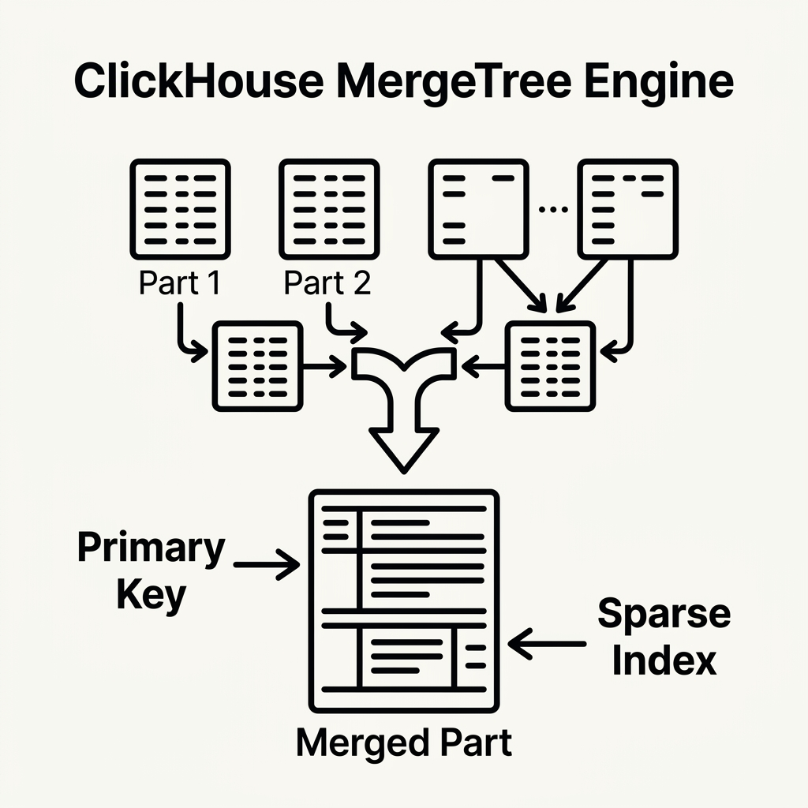

### 2. Materialized Views
In many databases, a materialized view is a stored result of a query that is refreshed periodically. In ClickHouse, a Materialized View acts like a **trigger**. When data is inserted into the source table, the Materialized View processes it in real-time and inserts the result into a target table! This allows for real-time accumulation of aggregates.

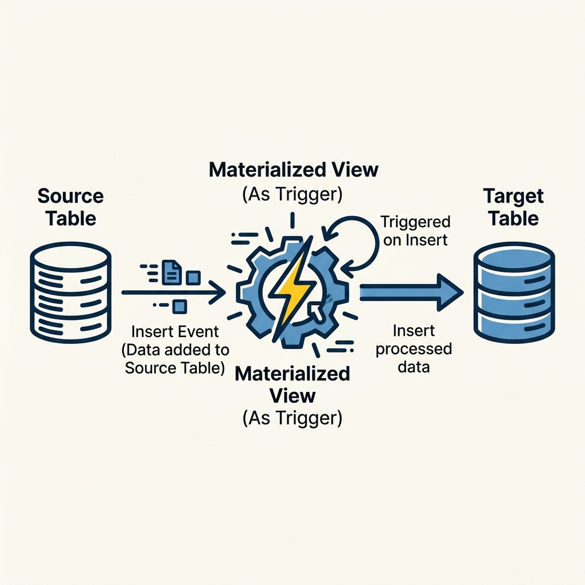

---

## ClickHouse vs Other Real-Time OLAP Engines

While data warehouses like Snowflake and BigQuery are great for batch analytics, systems requiring real-time data ingestion and querying often turn to specialized OLAP engines. Let's see how ClickHouse compares with **Apache Pinot**, **Apache Druid**, and **StarRocks**:

| Feature | ClickHouse | Apache Pinot | Apache Druid | StarRocks |
| :--- | :--- | :--- | :--- | :--- |
| **Storage Model** | Columnar | Columnar | Columnar | Columnar |
| **SQL Support** | Excellent (Custom dialect) | Good (Presto-like) | Good | Excellent (Fully MySQL compatible) |
| **Ingestion** | Pull/Push (Kafka, JDBC, etc.) | Pull/Push (Deep Kafka integration) | Pull/Push (Deep Kafka integration) | Pull/Push |
| **Primary Use Case** | Generall OLAP, Logs, Analytics | Real-time user-facing analytics | Time-series, real-time analytics | High-performance BI and real-time analytics |
| **Strength** | Insane single-node performance, MV power | Low latency for massive concurrent queries | Great with time-series data | Excellent join performance, easy to use |

ClickHouse stands out with its powerful Materialized Views and exceptional performance on massive datasets without requiring complex cluster setups for moderate scales.

---

## Real-World Example: URL Shortener Analytics

Let's look at how ClickHouse fits into a real-time URL shortener system. In such a system, we need to track every click on a short URL and provide real-time top-performing links. Here is how a typical analytics pipeline works:

### The Architecture Data Flow

1.  **User Click**: User accesses a short URL.
2.  **Read API**: Emits a `click-event` to Kafka.
3.  **Apache Flink**: Consumes events from Kafka, parses them, and pushes them to ClickHouse.
4.  **ClickHouse**: Aggregates raw events in real-time using a Materialized View.
5.  **Analytics API**: Queries ClickHouse for top links.

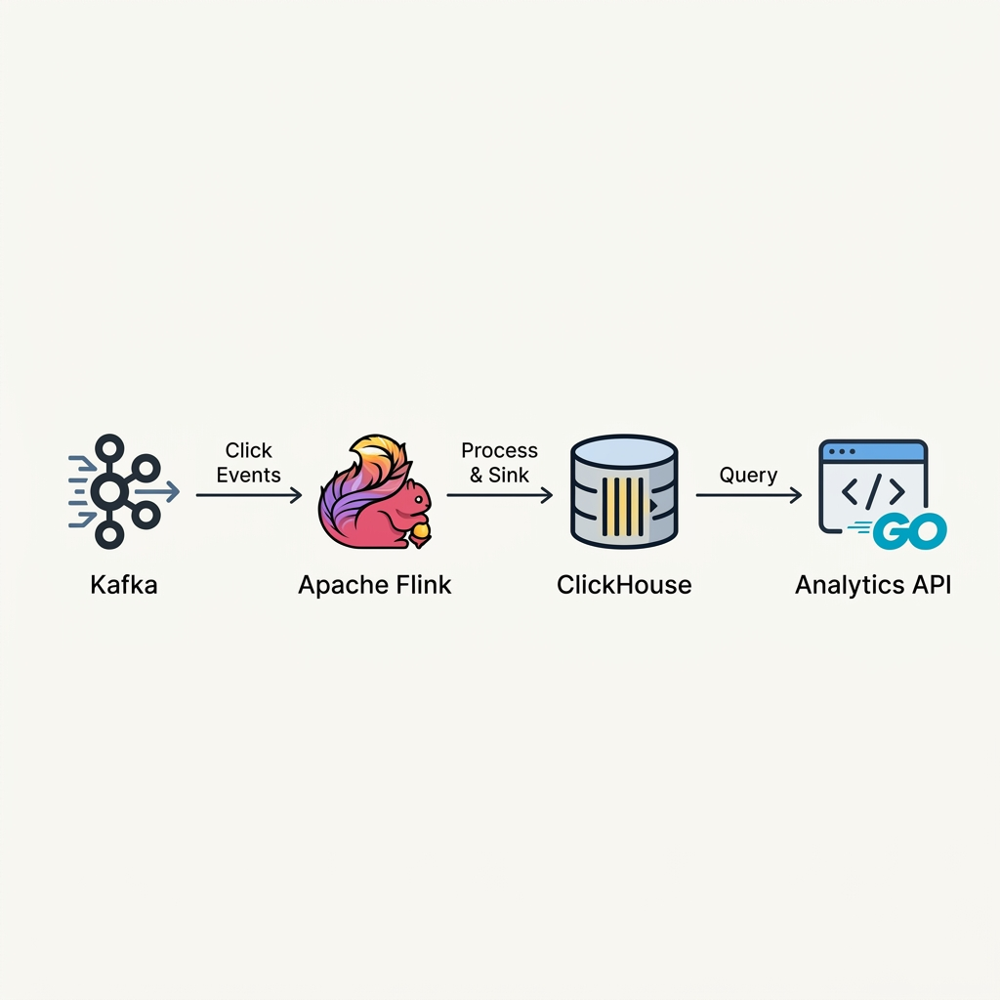

### The ClickHouse Schema

Let's look at a typical ClickHouse schema for this use case. We employ the **Null Engine Pattern** to avoid storing raw data and use a Materialized View for hourly aggregation.

```sql
-- 1. Buffer Table (Stores no data)
CREATE TABLE raw_click_events (
    event_time DateTime,
    short_code String,
    country_code String
) ENGINE = Null;

-- 2. Target Table for Aggregates
CREATE TABLE click_stats_hourly (
    hour DateTime,
    short_code String,
    country_code String,
    total_clicks AggregateFunction(count, UInt64)
) ENGINE = SummingMergeTree()
ORDER BY (hour, short_code, country_code);

-- 3. Materialized View (The Real-Time Trigger)
CREATE MATERIALIZED VIEW click_stats_mv TO click_stats_hourly AS
SELECT
    toStartOfHour(event_time) AS hour,
    short_code,
    country_code,
    countState() AS total_clicks
FROM raw_click_events
GROUP BY hour, short_code, country_code;
```

When Flink inserts data into `raw_click_events`, the data is immediately processed by `click_stats_mv` and aggregated into `click_stats_hourly`. The raw data is then discarded, saving massive amounts of storage while giving real-time hourly statistics!

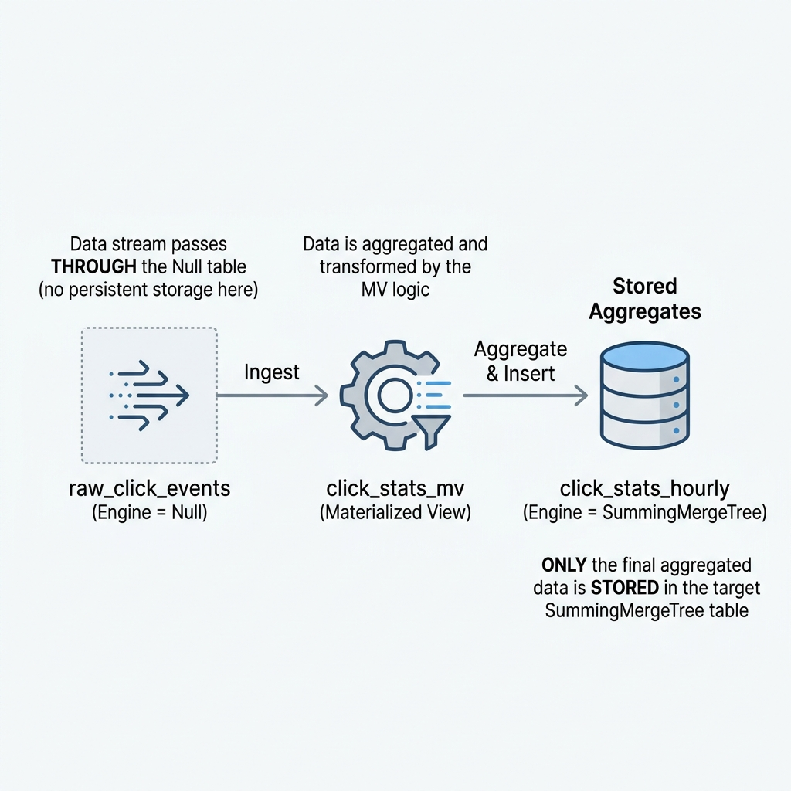

### Querying the Data

To get the top 10 performing links, the system simply queries the aggregated table:

```sql
SELECT short_code, countMerge(total_clicks) as clicks
FROM click_stats_hourly
GROUP BY short_code
ORDER BY clicks DESC
LIMIT 10;
```
Because the query uses pre-aggregated states, this query returns instantly even if there are billions of raw click events!

---

## Other Use Cases for ClickHouse

Beyond URL shorteners, ClickHouse is a perfect fit for a wide variety of analytical workloads. Let's explore some of the most common use cases in detail, with code examples for each.

### 1. Log Management and Analysis
Traditional log storage systems can become slow and expensive at scale. ClickHouse is increasingly used as a backend for log management (e.g., by SigNoz and Uber) because of its high compression rates and fast search capabilities.

**Schema Example:**
```sql
CREATE TABLE app_logs (
    timestamp DateTime,
    service_name String,
    level String,
    message String,
    attributes Map(String, String)
) ENGINE = MergeTree()
ORDER BY (service_name, timestamp);
```

**Query Example (Find error count per service in the last hour):**
```sql
SELECT service_name, count() AS error_count
FROM app_logs
WHERE level = 'ERROR' AND timestamp >= now() - INTERVAL 1 HOUR
GROUP BY service_name
ORDER BY error_count DESC;
```

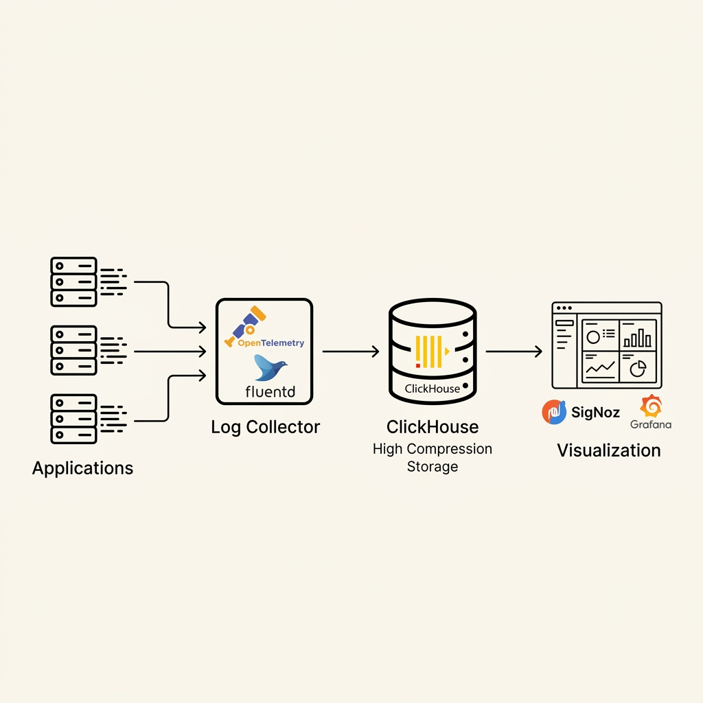

### 2. IoT Sensor Data
IoT applications generate massive volumes of time-series data from sensors. ClickHouse can handle the high-velocity ingestion and provide real-time aggregations.

**Schema Example:**
```sql
CREATE TABLE sensor_data (
    timestamp DateTime,
    sensor_id UInt32,
    location String,
    temperature Float32,
    humidity Float32
) ENGINE = MergeTree()
ORDER BY (sensor_id, timestamp);
```

**Query Example (Calculate average temperature per hour for a specific sensor):**
```sql
SELECT
    toStartOfHour(timestamp) AS hour,
    avg(temperature) AS avg_temp
FROM sensor_data
WHERE sensor_id = 12345 AND timestamp >= now() - INTERVAL 24 HOUR
GROUP BY hour
ORDER BY hour;
```

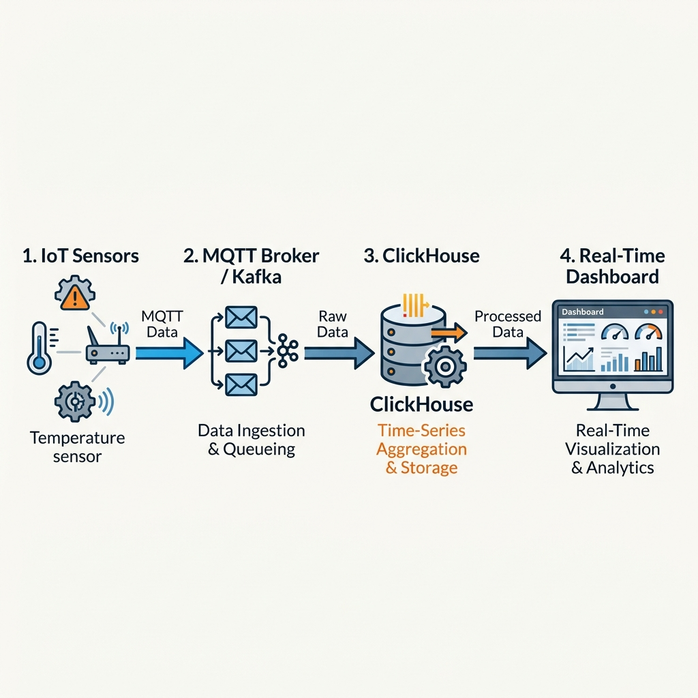

### 3. Financial Market Data
In finance, analyzing tick data (every quote and trade) requires processing billions of rows with minimal latency. ClickHouse is used for storage and real-time analysis of market data.

**Schema Example:**
```sql
CREATE TABLE stock_trades (
    timestamp DateTime64(3), -- Millisecond precision
    symbol String,
    price Float64,
    volume UInt32
) ENGINE = MergeTree()
ORDER BY (symbol, timestamp);
```

**Query Example (Calculate Volume Weighted Average Price (VWAP) for a stock today):**
```sql
SELECT
    symbol,
    sum(price * volume) / sum(volume) AS vwap
FROM stock_trades
WHERE symbol = 'AAPL' AND timestamp >= toDateTime('2026-03-29 00:00:00')
GROUP BY symbol;
```

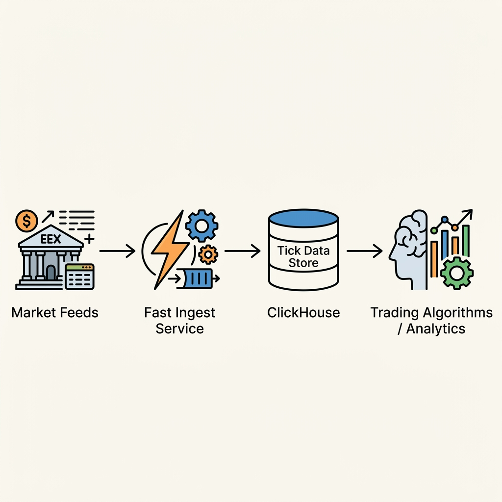

### 4. E-commerce Analytics
Tracking user interactions (views, clicks, purchases) allows e-commerce platforms to personalize experiences and analyze sales funnels in real-time.

**Schema Example:**
```sql
CREATE TABLE user_events (
    timestamp DateTime,
    user_id UInt64,
    event_type Enum8('view' = 1, 'click' = 2, 'purchase' = 3),
    product_id UInt32,
    amount Float64
) ENGINE = MergeTree()
ORDER BY (user_id, timestamp);
```

**Query Example (Find top 5 selling products by revenue today):**
```sql
SELECT
    product_id,
    sum(amount) AS total_revenue
FROM user_events
WHERE event_type = 'purchase' AND timestamp >= now() - INTERVAL 1 DAY
GROUP BY product_id
ORDER BY total_revenue DESC
LIMIT 5;
```

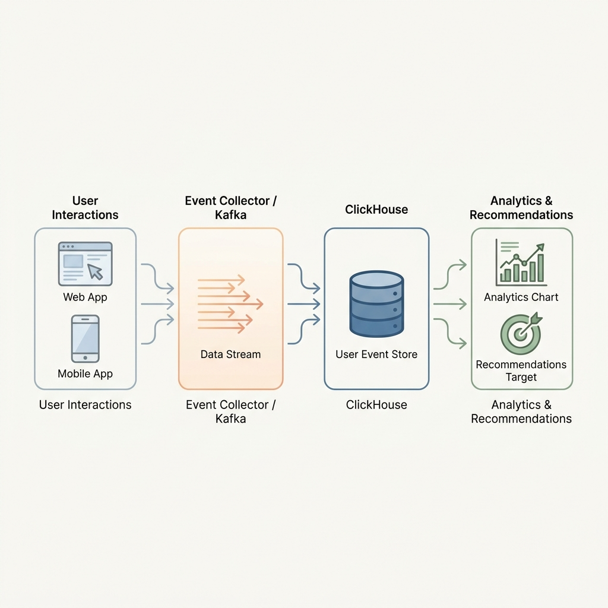

## Conclusion

ClickHouse is a powerhouse for real-time analytics. By utilizing columnar storage and Materialized Views, it is possible to build a highly efficient analytics pipeline that scales effortlessly.

If you are building systems that require real-time insights on large volumes of data, ClickHouse is definitely a tool you should evaluate.

---

## References & Further Reading

To explore more about ClickHouse, here are some helpful resources:
-   **ClickHouse Official Site**: `https://clickhouse.com/`
-   **Official Documentation**: `https://clickhouse.com/docs/en/`
-   **ClickHouse GitHub**: `https://github.com/ClickHouse/ClickHouse`
-   **SigNoz (Using ClickHouse for Logs)**: `https://signoz.io/`
-   **Altinity (ClickHouse Knowledge Base)**: `https://altinity.com/`
