# Mastering Envoy Proxy: Building a Resilient URL Shortener

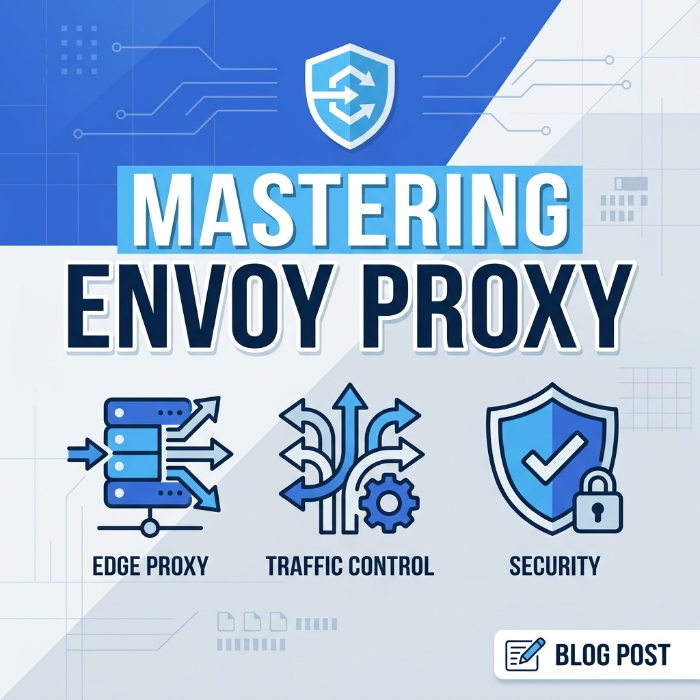

In modern microservices architecture, managing traffic, security, and observability at the edge is critical. **Envoy Proxy**, an open-source L7 edge and service proxy, has become the industry standard for these tasks. Originally built at Lyft, it is now a cornerstone of the Cloud Native Computing Foundation (CNCF).

In this technical deep-dive, we will explore the core concepts of Envoy and see how it was used to power a high-performance **URL Shortener** application. We’ll cover everything from routing and rate limiting to security and advanced deployment patterns.

---

## 1. What is Envoy Proxy?

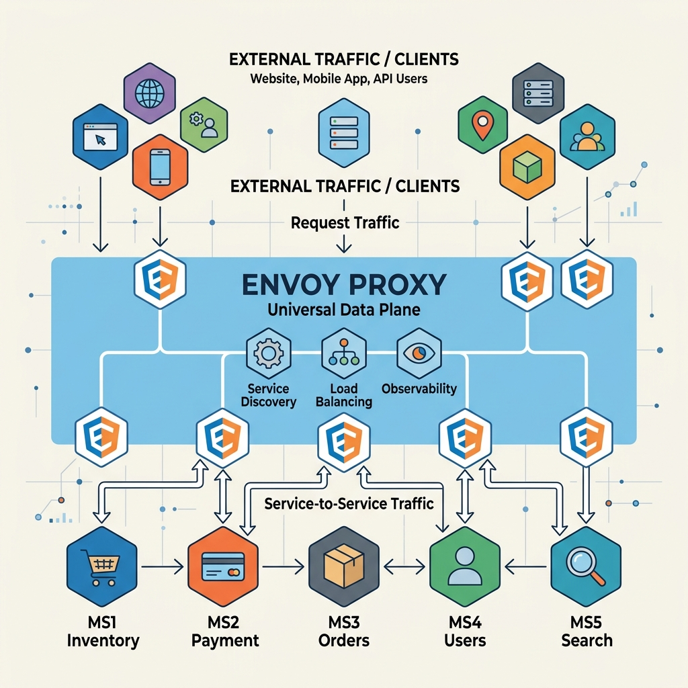

Envoy is a high-performance C++ distributed proxy designed for single services and applications, as well as a communication bus and "universal data plane" designed for large microservice "service mesh" architectures.

**Key Features:**
*   **L7 Architecture:** Understands HTTP/2, gRPC, and MongoDB protocols.
*   **Observability:** Built-in support for distributed tracing (Zipkin, Jaeger, LightStep) and metrics.
*   **Extensibility:** Powerful filter chain model and support for WebAssembly (Wasm) filters.
*   **Dynamic Configuration:** The "xDS" APIs allow for real-time configuration updates without restarting the proxy.

---

## 2. Core Concepts: The Building Blocks

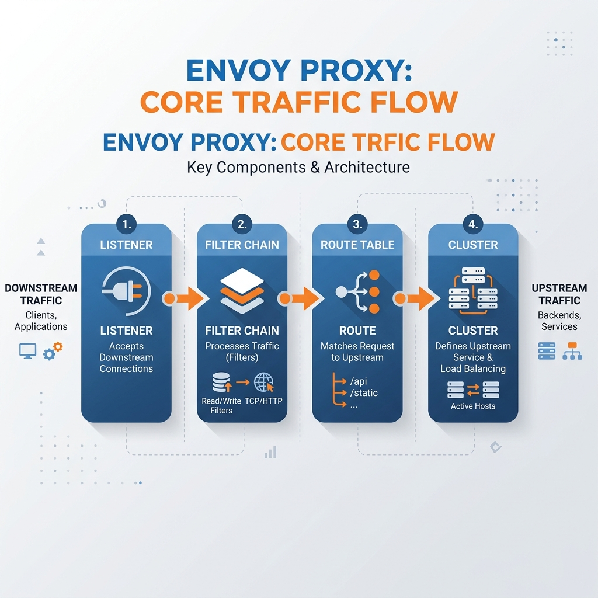

To understand Envoy, you must understand its four primary components:

1.  **Listeners**: A named network location (e.g., port 80 or 443) that accepts incoming connections.
2.  **Filter Chains**: A series of filters that process the request. Filters can handle everything from TLS termination to JWT validation.
3.  **Routes**: Instructions on how to map a request (e.g., based on path or headers) to a backend.
4.  **Clusters**: A group of logically similar upstream hosts (your backend services) that Envoy routes traffic to.

---

## 3. Case Study: The URL Shortener Architecture

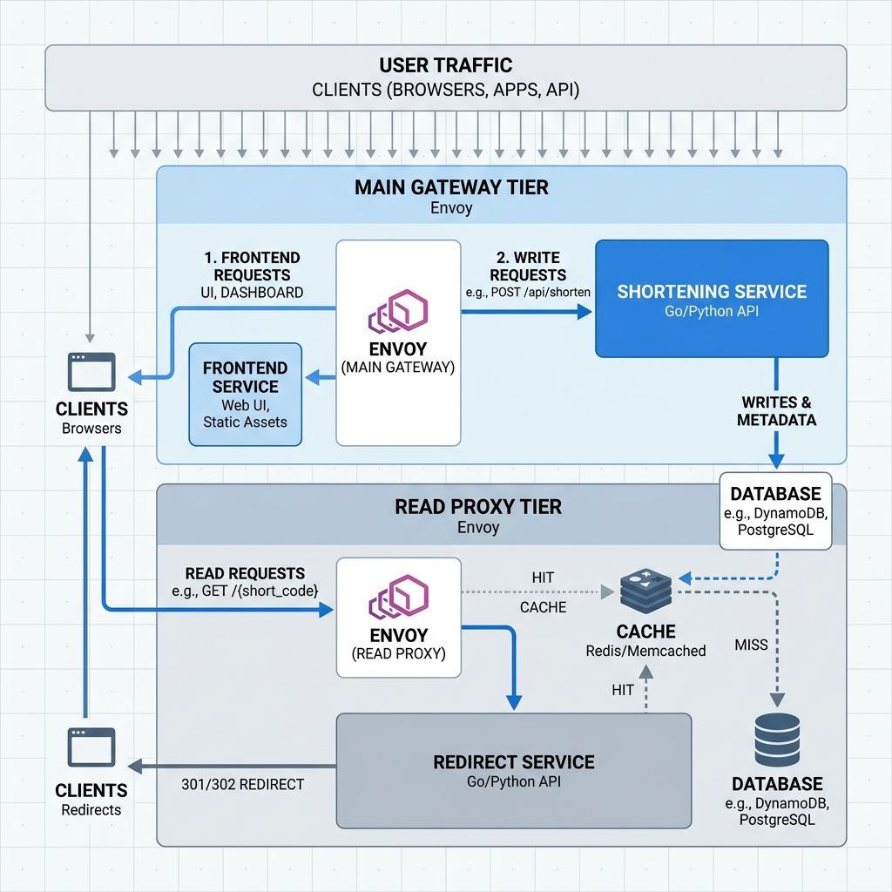

In our URL Shortener project, we implemented a **Two-Tier Envoy Architecture** to achieve traffic isolation and extreme performance for redirections.

*   **`envoy` (Main Gateway)**: Handles write operations (creating links), user analytics, and frontend traffic. It is heavy on security (JWT, CORS).
*   **`envoy-read` (Read Proxy)**: Specialized for one task—resolving short URLs to their long destinations. It is stripped of all non-essential filters for maximum speed.

---

## 4. Usage 1: Traffic Routing & API Gateway

Envoy acts as our API Gateway, routing requests to the appropriate microservice based on the URL path.

### Path-Based Routing (Main Gateway)

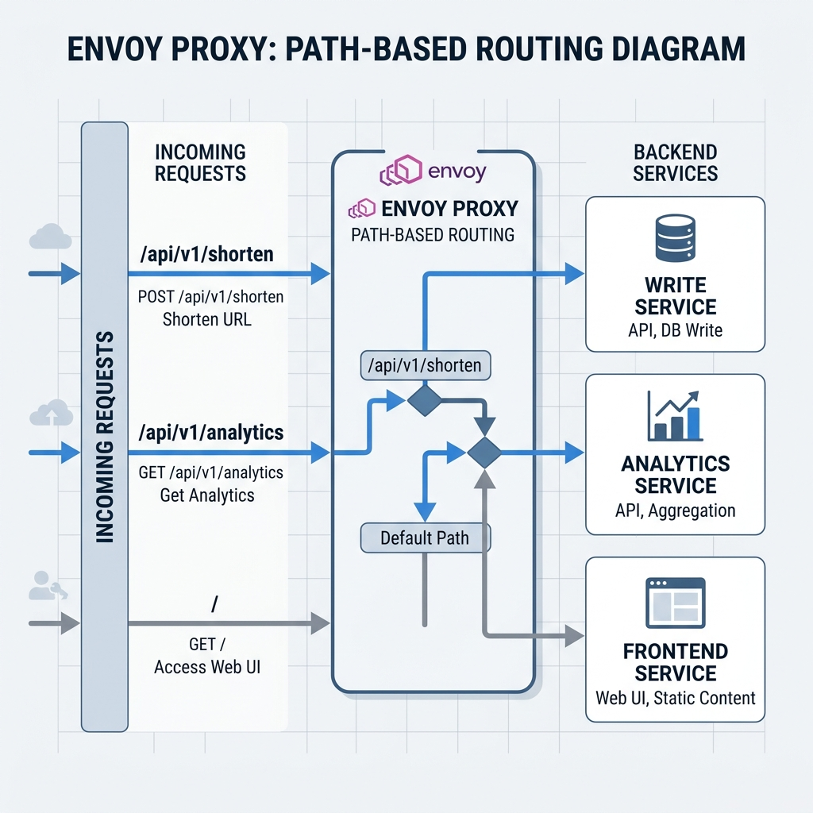

The main gateway routes traffic to the `write-api`, `analytics-api`, or the `frontend`.

```yaml
# Simplified envoy-config.yaml
routes:
- match:
    prefix: "/api/v1/shorten"
  route:
    cluster: write_api_service
- match:
    prefix: "/api/v1/analytics"
  route:
    cluster: analytics_api_service
- match:
    prefix: "/"
  route:
    cluster: frontend_service
```

### Regex-Based Routing (Read Proxy)

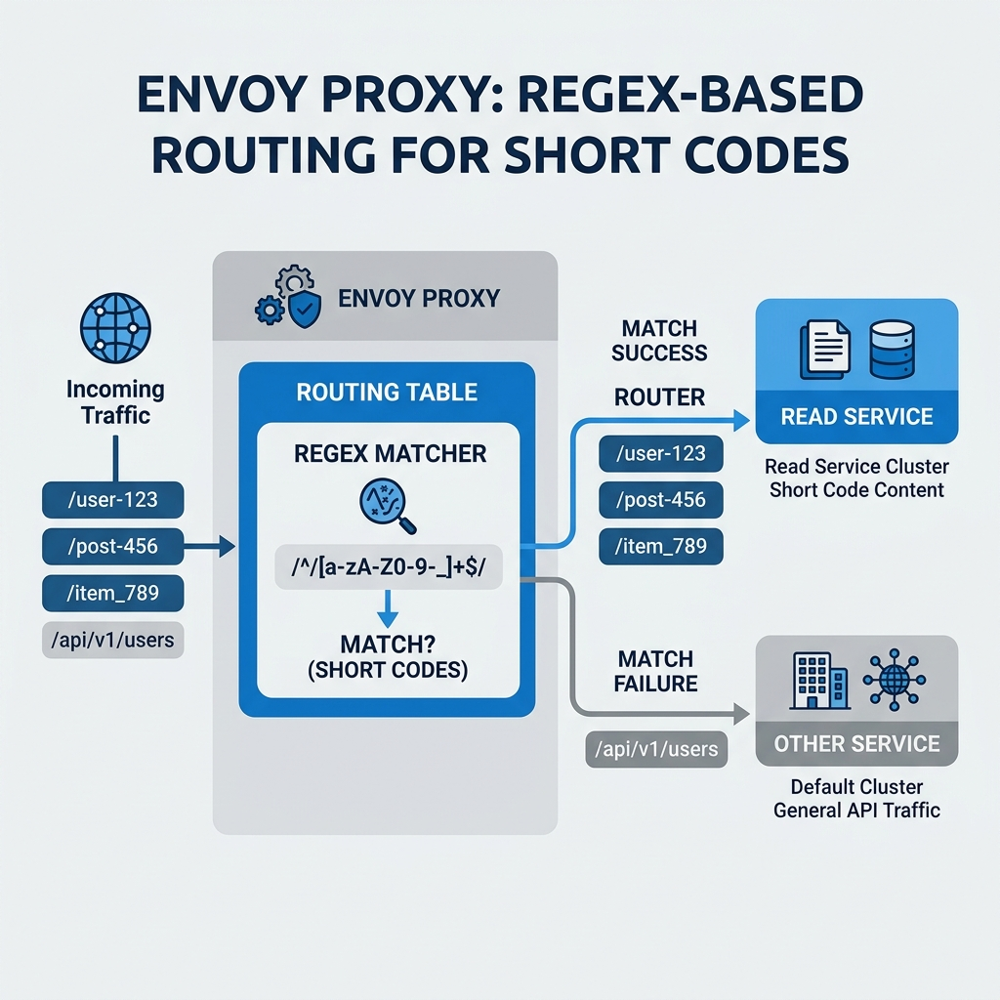

The `envoy-read` proxy uses a regular expression to capture any alphanumeric short code and send it to the `read-api`.

```yaml
# envoy-config-read.yaml
routes:
- match:
    safe_regex:
      google_re2: {}
      regex: "^/[a-zA-Z0-9-_]+$"
  route:
    cluster: read_api_service
```

---

## 5. Usage 2: Edge Security (JWT & CORS)

Handling authentication at the edge prevents unauthenticated traffic from even reaching your backend services, saving resources and simplifying backend logic.

### JWT Authentication

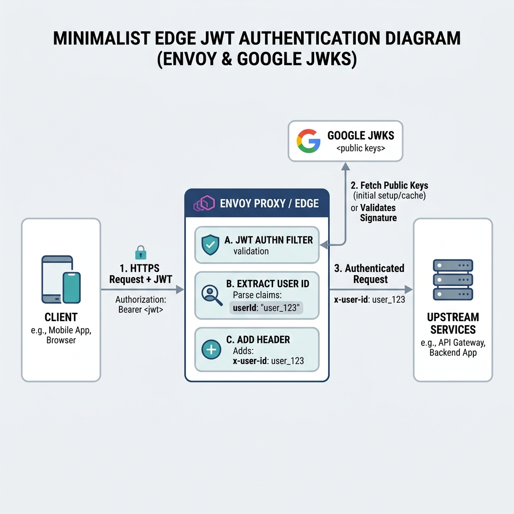

We use the `envoy.filters.http.jwt_authn` filter to validate Google Identity JWTs. Envoy automatically fetches public keys from Google and validates the signature.

```yaml
http_filters:
- name: envoy.filters.http.jwt_authn
  typed_config:
    "@type": type.googleapis.com/envoy.extensions.filters.http.jwt_authn.v3.JwtAuthentication
    providers:
      google_identity_provider:
        issuer: "https://securetoken.google.com/YOUR_PROJECT"
        audiences: ["YOUR_PROJECT"]
        remote_jwks:
          http_uri:
            uri: "https://www.googleapis.com/service_accounts/v1/jwk/securetoken@system.gserviceaccount.com"
            cluster: google_jwks_cluster
            timeout: 5s
        claim_to_headers:
          - header_name: "x-user-id"
            claim_name: "sub"
```
*Note: The `claim_to_headers` feature is powerful; it extracts the user ID from the JWT and passes it to the backend as a standard HTTP header.*

---

## 6. Usage 3: Rate Limiting (Defense in Depth)

Our URL shortener employs two layers of rate limiting to protect against DDoS and abuse.

### Local Rate Limiting

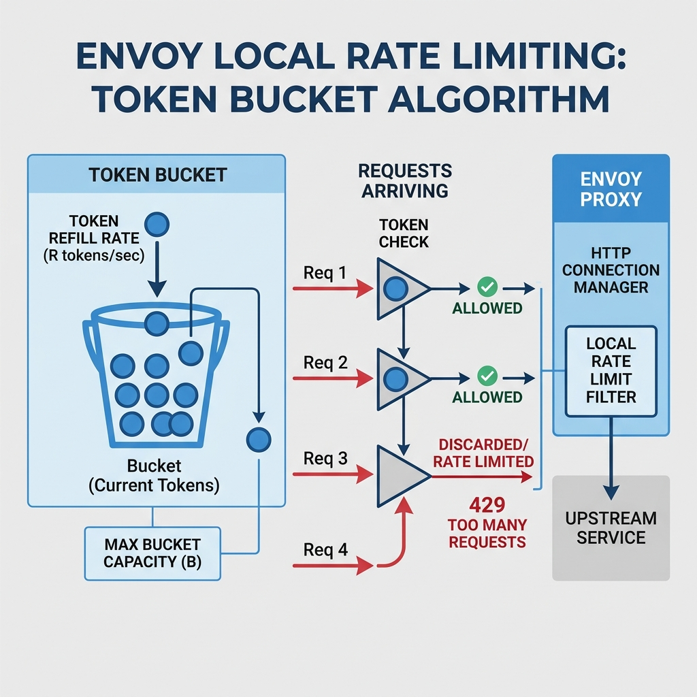

Enforced independently by each Envoy pod using a **Token Bucket** algorithm. This is extremely fast as it requires no network calls.

```yaml
- name: envoy.filters.http.local_ratelimit
  typed_config:
    "@type": type.googleapis.com/envoy.extensions.filters.http.local_ratelimit.v3.LocalRateLimit
    stat_prefix: http_local_rate_limiter
    token_bucket:
      max_tokens: 100
      tokens_per_fill: 100
      fill_interval: 1s
```

### Global Rate Limiting

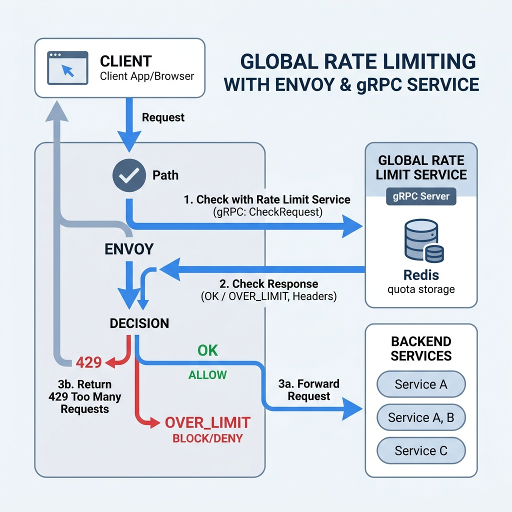

For a more global view (e.g., limiting a user across all pods), Envoy communicates with an external gRPC rate-limit service.

```yaml
# Envoy configuration (envoy-config.yaml)
- name: envoy.filters.http.ratelimit
  typed_config:
    "@type": type.googleapis.com/envoy.extensions.filters.http.ratelimit.v3.RateLimit
    domain: envoy
    rate_limit_service:
      grpc_service:
        envoy_grpc:
          cluster_name: rate_limit_service
```

The external rate-limit service (like `envoyproxy/ratelimit`) needs its own configuration to define these limits. Here is how we configured it for our URL shortener:

```yaml
# Rate-limit service configuration (ratelimit-config.yaml)
domain: envoy
descriptors:
  - key: generic_key
    value: write_api
    rate_limit:
      requests_per_unit: 500
      unit: second
---
domain: envoy-read
descriptors:
  - key: generic_key
    value: read_api
    rate_limit:
      requests_per_unit: 5000
      unit: second
```
*Note: In `envoy-read`, we allow 10x more traffic (5000 req/sec) compared to the write API (500 req/sec), reflecting the typical read-heavy nature of URL shorteners.*

---

## 7. Advanced Industry Standard Usage

Beyond being an API Gateway, Envoy is used in several sophisticated ways across the industry:

### A. Service Mesh Data Plane

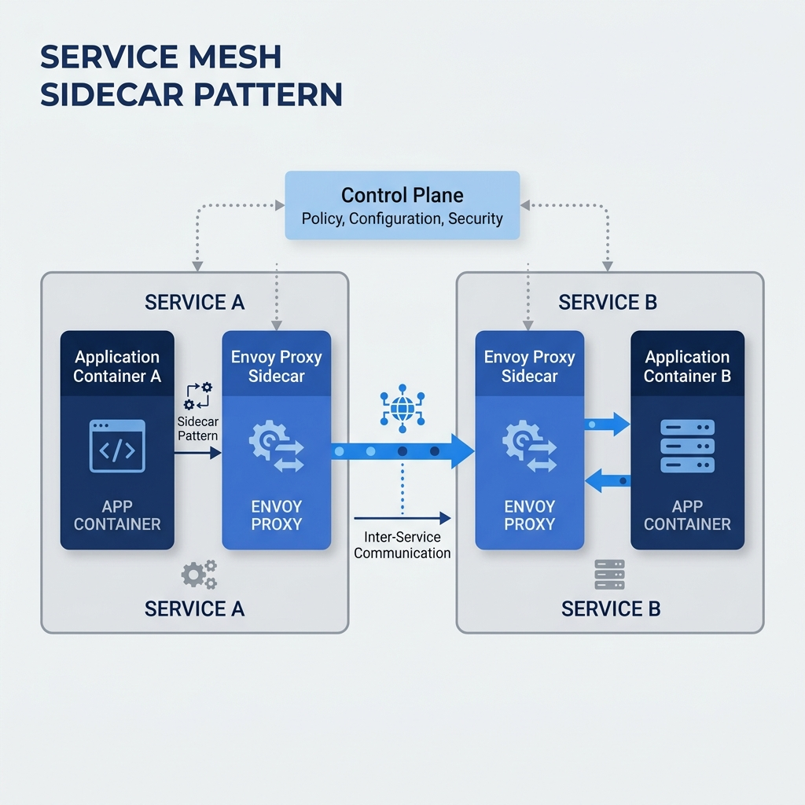

In a service mesh (like **Istio** or **Linkerd**), an Envoy proxy is deployed as a "sidecar" next to every service instance. This allows for:
*   **mTLS**: Transparent encryption between services.
*   **Circuit Breaking**: Automatically cutting off traffic to a failing service to prevent cascading failures.
*   **Retries & Timeouts**: Moving resilience logic out of the application code and into the infrastructure.

### B. Wasm Filters

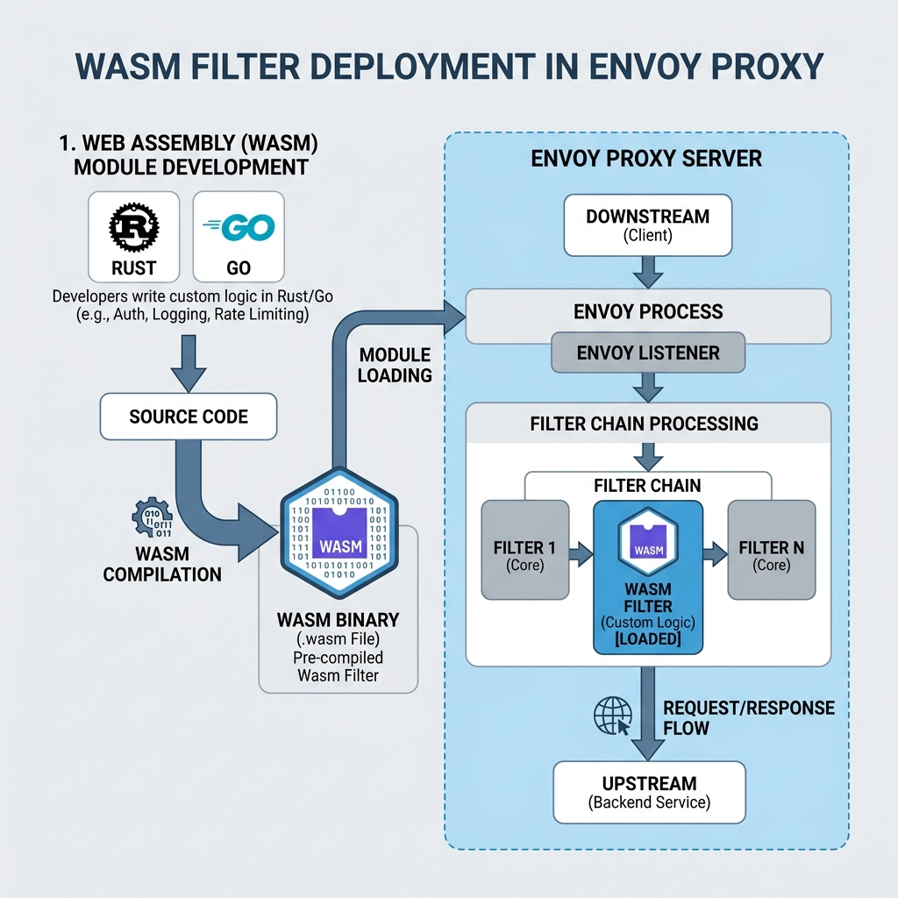

If you need custom logic (e.g., a proprietary auth header or request transformation), you can write a **WebAssembly (Wasm)** filter in Rust, C++, or Go and load it into Envoy at runtime without recompiling the proxy.

### C. Blue/Green & Canary Deployments

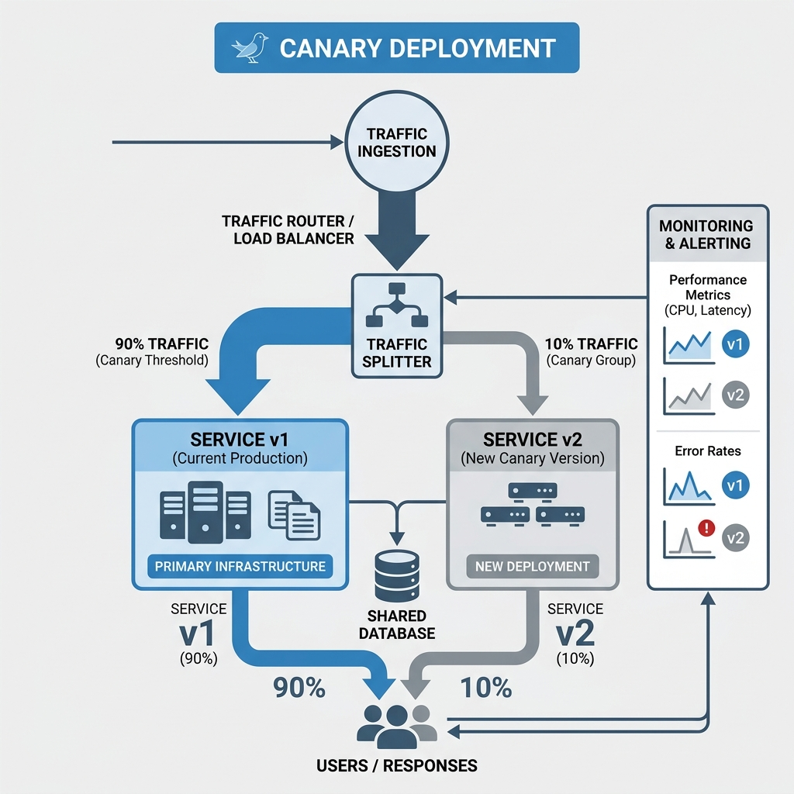

Envoy can perform weighted cluster routing, making it easy to roll out new versions of a service.

```yaml
routes:
- match: { prefix: "/" }
  route:
    weighted_clusters:
      clusters:
        - name: service_v1
          weight: 90
        - name: service_v2
          weight: 10
```

### D. Observability with OpenTelemetry

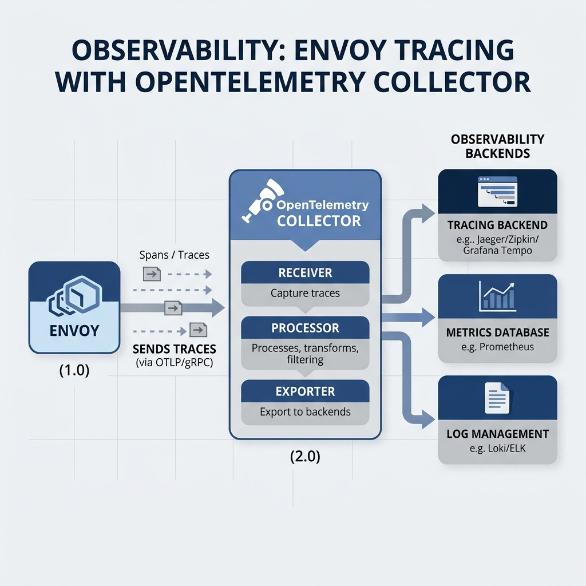

Envoy is natively compatible with **OpenTelemetry**. It can generate spans for every request and send them to collectors like SigNoz or Jaeger, providing a full trace of a request from the edge to the database.

### E. Health Checking: Active vs. Passive

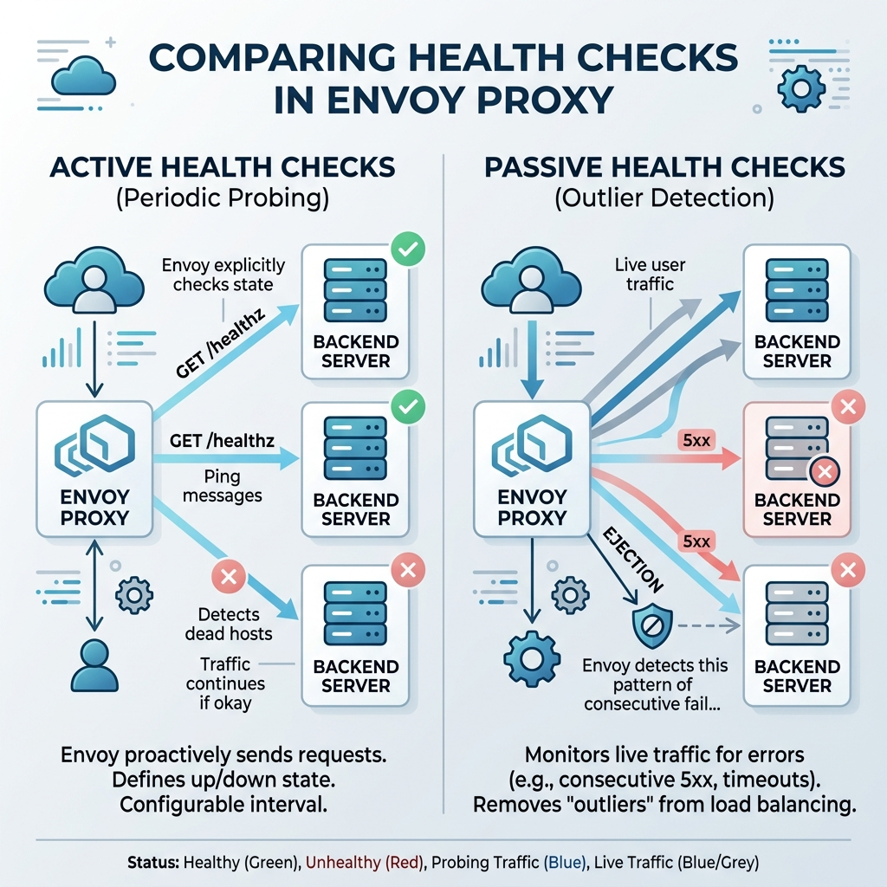

Envoy provides sophisticated mechanisms to ensure traffic only flows to healthy backends:
*   **Active Health Checks**: Envoy periodically sends a probe (HTTP, gRPC, or TCP) to the upstream hosts.
*   **Passive Health Checking (Outlier Detection)**: Envoy "observes" the live traffic. If a host returns a 5xx error multiple times, Envoy will temporarily "eject" it from the load balancing pool.

```yaml
# Simplified cluster configuration with health checks
clusters:
- name: write_api_service
  health_checks:
    - timeout: 1s
      interval: 10s
      unhealthy_threshold: 2
      healthy_threshold: 2
      http_health_check:
        path: "/health"
  outlier_detection:
    consecutive_5xx: 5
    base_ejection_time: 30s
```

---

## Conclusion

Envoy Proxy is more than just a load balancer; it is a programmable networking foundation. By moving concerns like Rate Limiting, JWT Validation, and Routing to Envoy, we allowed our URL Shortener backend to focus entirely on core business logic—making the system more modular, secure, and observable.

Whether you are building a small project or a massive microservices architecture, Envoy is a tool worth mastering.

---
*Ready to dive deeper? Check out the [Envoy Documentation](https://www.envoyproxy.io/docs/envoy/latest/) and start experimenting with your own `envoy.yaml`!*
