# Real-time Analytics with Apache Flink: A Hands-on Guide


In the world of high-scale systems, the ability to process and react to data the moment it's generated is a competitive necessity. Whether you are detecting financial fraud, monitoring IoT sensors, or tracking user engagement, waiting for nightly batch jobs is no longer enough.

This blog post explores how **Apache Flink** powers professional real-time analytics engines. To ground these concepts, we will use a **URL Shortener** application as our primary case study, demonstrating how to transform raw events into actionable insights.

---

## 1. Core Concepts of Apache Flink

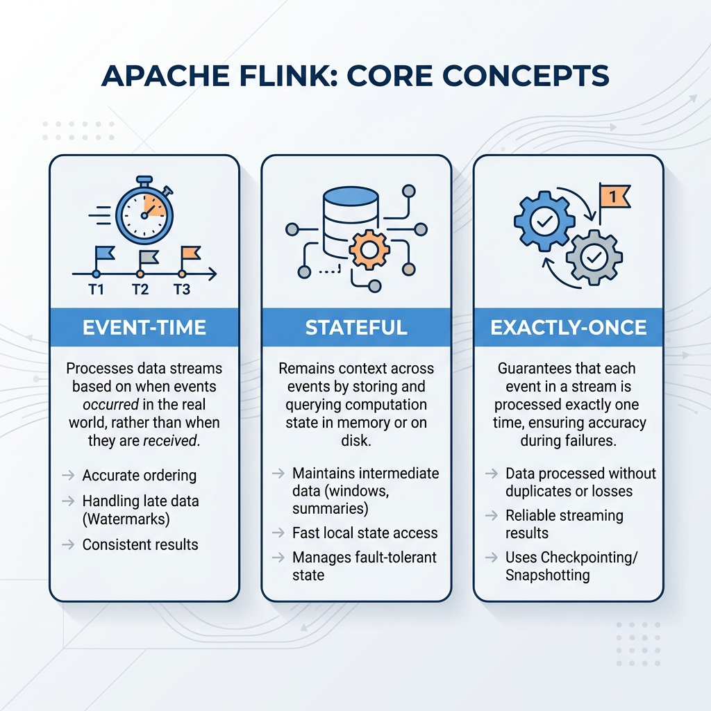

Apache Flink is an open-source, unified stream and batch processing framework. While many systems try to "fake" streaming by using micro-batches, Flink treats everything as a continuous stream by default.

Key features include:
- **Event-Time Processing:** Processes events based on when they *actually occurred* (e.g., the click timestamp), not just when they arrived at the processor.
- **Stateful Computations:** Remembers information across events, enabling complex patterns like sessionization, running totals, and pattern matching.
- **Exactly-Once Semantics:** Guarantees that every event is processed correctly exactly once, even in the face of cluster failures.
- **Scalability:** Built to scale from a single node to thousands, handling millions of events per second with millisecond latency.

---

## 2. Architecture Overview: The Streaming Pipeline

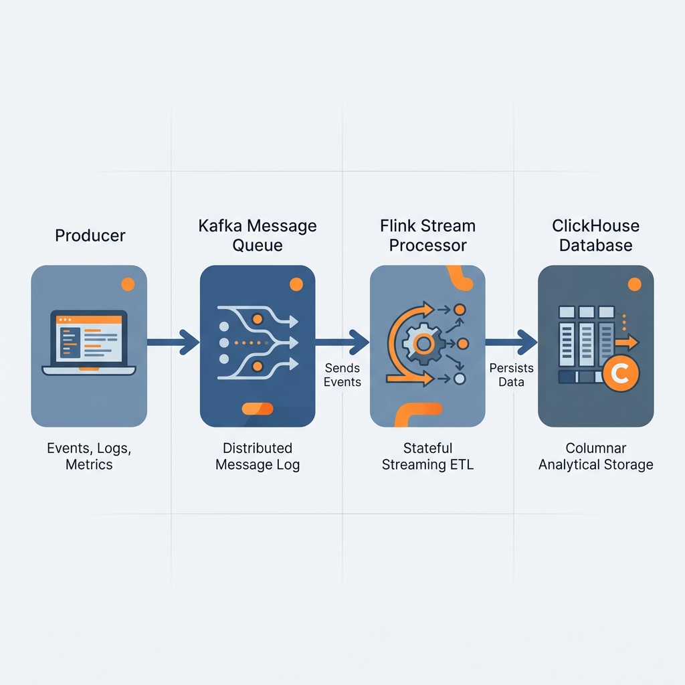

A modern analytics pipeline is usually decoupled and resilient. In our case study, the architecture consists of:

1.  **Event Producer:** An application (e.g., our `read-api`) generates events. In our example, every link click emits a structured event.
2.  **Message Broker (Apache Kafka):** Acts as a high-throughput buffer, ensuring that the performance-sensitive ingestion path is completely decoupled from the processing logic.
3.  **Stream Processor (Apache Flink):** Consumes raw events from Kafka, cleanses data, applies watermarks for out-of-order handling, and performs aggregations.
4.  **OLAP Storage (ClickHouse):** An ultra-fast database optimized for analytical queries, allowing users to query aggregated data in real-time.

---

## 3. The Flink Runtime: JobManager vs. TaskManager

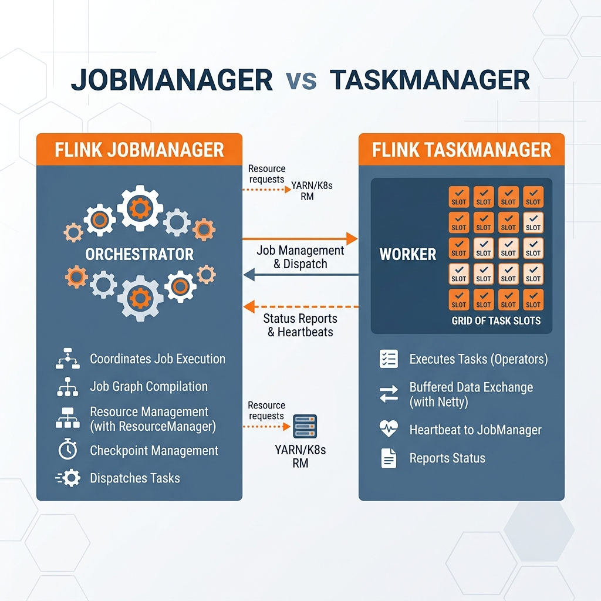

Flink executes pipelines using a distributed master-worker architecture.

### JobManager (The Orchestrator)
The JobManager is the "brain" of the cluster. It schedules tasks, coordinates checkpoints for fault tolerance, and manages the lifecycle of each job. When you submit a job, the JobManager turns your code into an execution graph.

### TaskManager (The Worker)
TaskManagers are the "muscle." They provide "Task Slots," which are fixed units of resources (CPU/Memory). They execute the actual operators (Map, Filter, Sink) and handle the high-speed data exchange between different stages of the pipeline.

---

## 4. Implementation: SQL vs. Java

Flink provides multiple levels of abstraction. For most data movement tasks, **Flink SQL** is sufficient. For complex business logic, the **Java DataStream API** is required.

### Option A: Flink SQL (Declarative ETL)
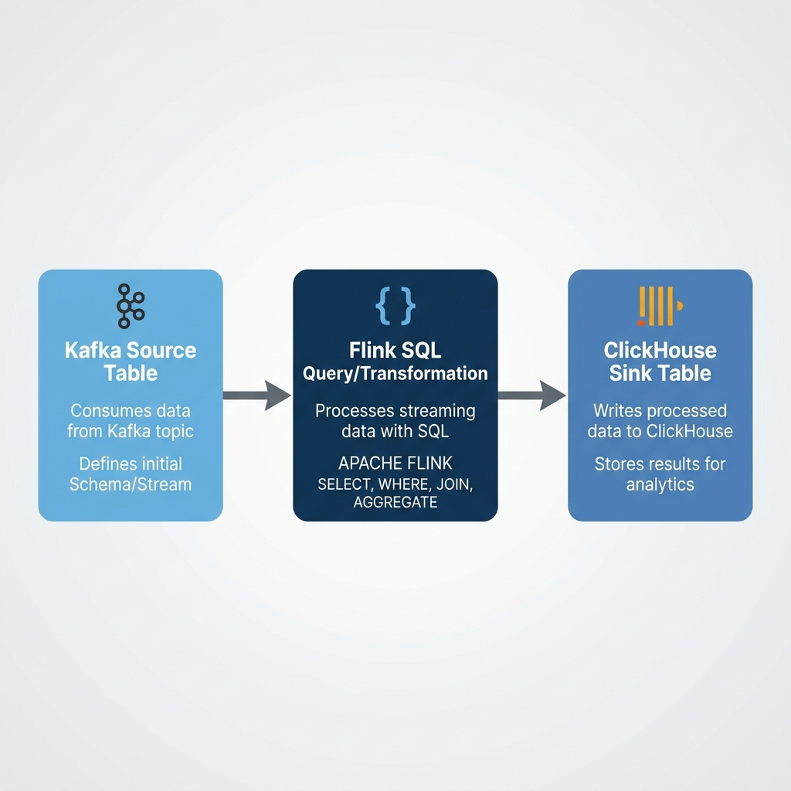

SQL is ideal for standard ingestion. You define your source and sink as tables and connect them with a simple query.

```sql
-- Define the Kafka Source
CREATE TABLE input_events (
    event_id STRING,
    `timestamp` STRING,
    event_type STRING,
    -- Parse timestamp and handle 5-second out-of-order delay
    event_time AS TO_TIMESTAMP(REPLACE(REPLACE(`timestamp`, 'T', ' '), 'Z', ''), 'yyyy-MM-dd HH:mm:ss'),
    WATERMARK FOR event_time AS event_time - INTERVAL '5' SECOND
) WITH (
    'connector' = 'kafka',
    'topic' = 'raw-events',
    'properties.bootstrap.servers' = '${KAFKA_BOOTSTRAP_SERVERS}',
    'format' = 'json'
);

-- Ingest into ClickHouse
INSERT INTO analytics_sink SELECT event_time, event_id, event_type FROM input_events;
```

### Option B: Java DataStream API (Imperative Control)
Java provides full control over serialization, custom logic, and manual state management.

```java
// Configure the Kafka Source
KafkaSource<String> source = KafkaSource.<String>builder()
    .setBootstrapServers(kafkaBootstrapServers)
    .setTopics("raw-events")
    .setValueOnlyDeserializer(new SimpleStringSchema())
    .build();

// Define a custom processing pipeline
DataStream<Event> stream = env.fromSource(source, WatermarkStrategy.noWatermarks(), "Kafka Source")
    .map(json -> parseJson(json)) // Custom mapping logic
    .assignTimestampsAndWatermarks(
        WatermarkStrategy.<Event>forBoundedOutOfOrderness(Duration.ofSeconds(5))
            .withTimestampAssigner((event, ts) -> event.timestamp)
    );

stream.addSink(jdbcSink);
```

---

## 5. Deployment: Packaging for Kubernetes

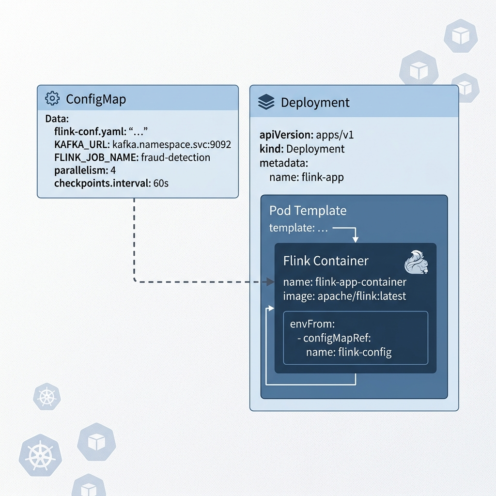

Modern streaming applications are typically deployed on Kubernetes for elasticity and ease of management.

### 5.1 External Configuration (The K8s Way)
Best practices dictate that we never hardcode infrastructure details. We use **Kubernetes ConfigMaps** to inject environment variables.

```yaml
# k8s/flink/flink-configmap.yaml
apiVersion: v1
kind: ConfigMap
metadata:
  name: flink-config
data:
  KAFKA_BOOTSTRAP_SERVERS: "kafka:9092"
  CLICKHOUSE_URL: "jdbc:mysql://clickhouse:9004/default"
```

In our **HyperShort** project, you can switch between the SQL and Java implementations using a simple flag:
```bash
./run.sh --flink=sql   # Uses the SQL implementation
./run.sh --flink=java  # Uses the Java implementation
```

---

## 6. Real-time Aggregations: ClickHouse Materialized Views

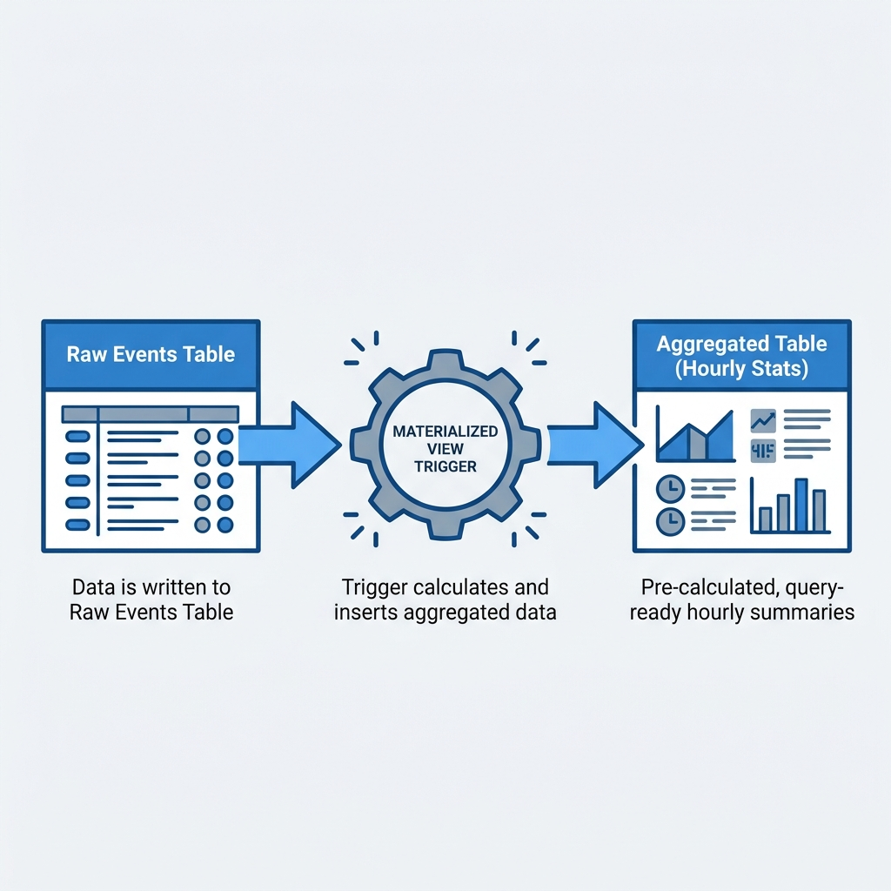

Once Flink sinks data into ClickHouse, we use **Materialized Views** to pre-calculate statistics. This ensures that the user-facing dashboard remains fast regardless of the total data volume.

```sql
-- Materialized View for Hourly Aggregation
CREATE MATERIALIZED VIEW stats_hourly_mv TO stats_hourly AS
SELECT
    toStartOfHour(event_time) AS hour,
    event_type,
    countState() AS total_count
FROM raw_events
GROUP BY hour, event_type;

-- Query for Dashboard
SELECT event_type, countMerge(total_count) as total
FROM stats_hourly
WHERE hour >= now() - INTERVAL 24 HOUR
GROUP BY event_type;
```

---

## 7. Operational Resilience

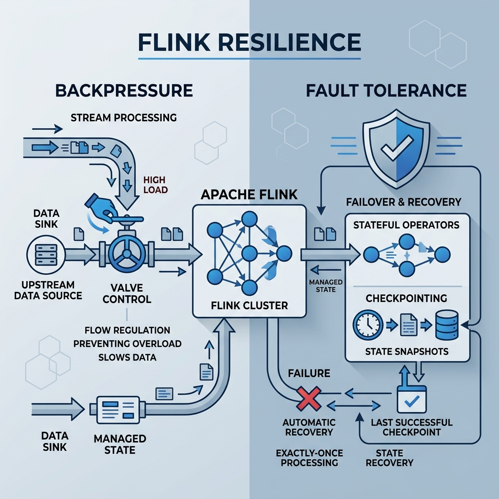

Flink is designed for "Mission Critical" applications. It handles high-pressure situations gracefully:

- **Backpressure Handling:** If the downstream database (ClickHouse) slows down, Flink automatically throttled its consumption from Kafka, preventing memory overflows.
- **Fault Tolerance:** If a node crashes, Flink uses its internal **Checkpoints** to resume processing from the exact millisecond it stopped.
- **Event-Time Consistency:** Using **Watermarks**, Flink can wait for late-arriving data (e.g., from a mobile device that lost connectivity) and still produce correct hourly results.

---

## 8. From SQL to Java: Flink's Layers of Abstraction

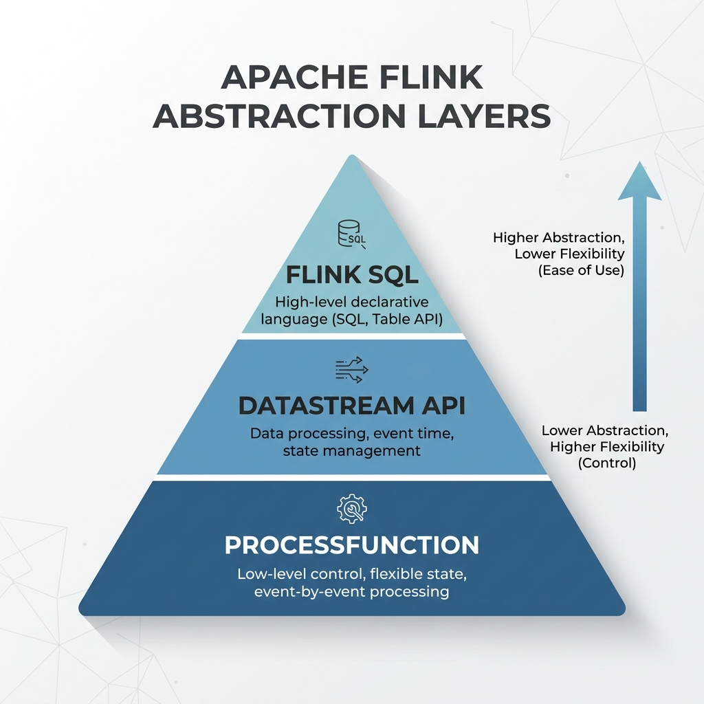

Why move to Java if SQL works? Flink provides a hierarchy of control:
1.  **Flink SQL**: Best for high-velocity development and standard data movement.
2.  **DataStream API**: Essential for complex multi-stream joins, custom windowing, and side outputs.
3.  **ProcessFunction**: The "Expert Mode" where you have direct access to state and timers.

---

## 9. Going Deeper: Advanced Real-world Patterns

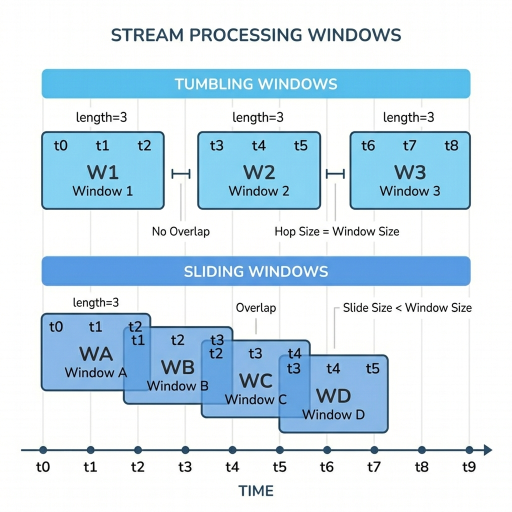

### 9.1 Managed State: Real-time Fraud Detection
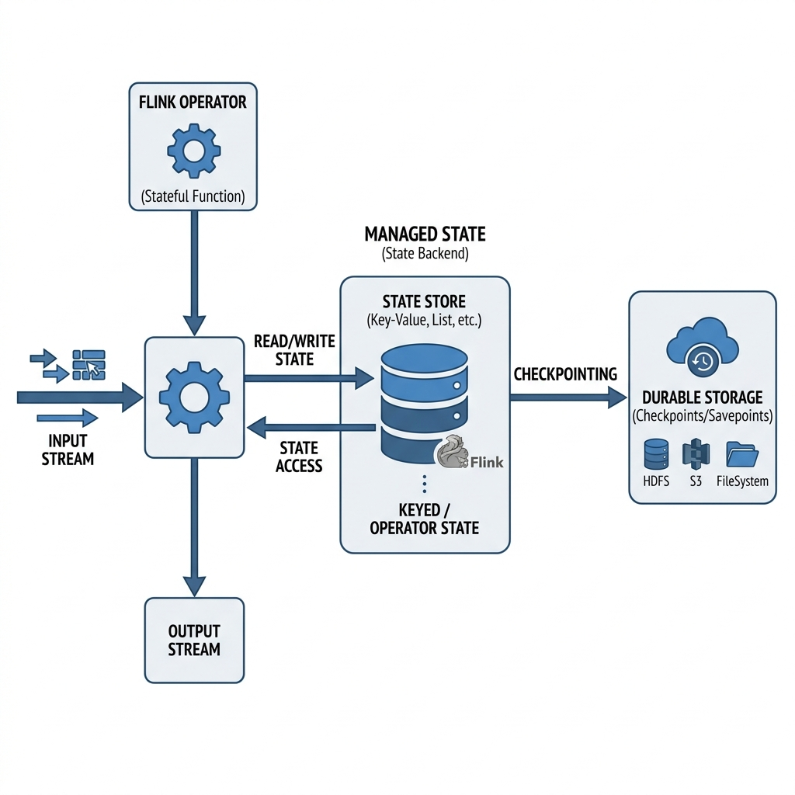

Stateful processing allows you to track patterns over time. For example, detecting "Bot Traffic" by flagging IPs that generate more than 100 events in a minute requires **Keyed State**.

```java
public class FraudDetector extends KeyedProcessFunction<String, Event, String> {
    private ValueState<Integer> countState;

    @Override
    public void processElement(Event event, Context ctx, Collector<String> out) throws Exception {
        Integer count = countState.value();
        count = (count == null) ? 1 : count + 1;
        countState.update(count);

        if (count > 100) out.collect("ALERT: High frequency detected for " + ctx.getCurrentKey());
    }
}
```

### 9.2 Sliding Windows: Trending Analysis
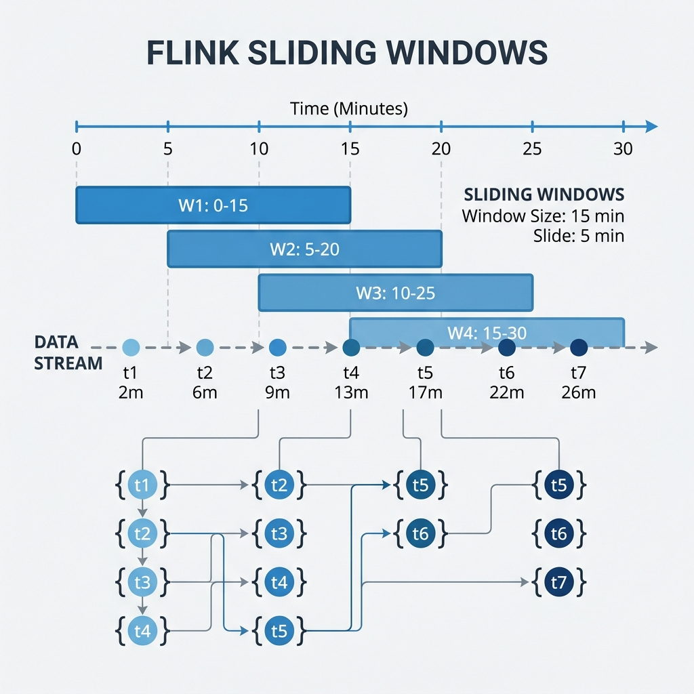

Tumbling windows are fixed, but **Sliding Windows** allow you to calculate rolling averages—perfect for "Top 10 Trending Products in the last 15 minutes," updated every minute.

```java
DataStream<Tuple2<String, Long>> trending = stream
    .keyBy(Event::getId)
    .window(SlidingEventTimeWindows.of(Time.minutes(15), Time.minutes(1)))
    .count();
```

### 9.3 Side Outputs: Stream Branching
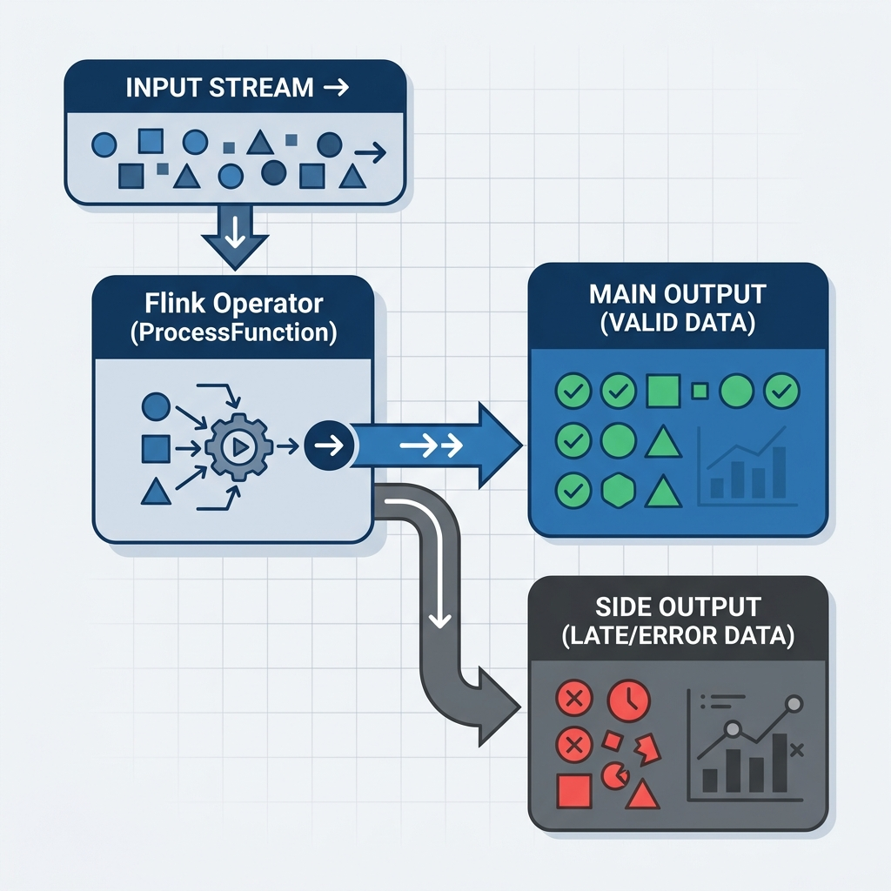

Instead of filtering out "bad" data, use **Side Outputs** to divert it to a separate analysis stream (Dead Letter Queue) without interrupting your main pipeline.

```java
final OutputTag<Event> botTag = new OutputTag<Event>("bot-traffic"){};

SingleOutputStreamOperator<Event> mainStream = stream.process(new ProcessFunction<Event, Event>() {
    @Override
    public void processElement(Event event, Context ctx, Collector<Event> out) {
        if (event.isBot()) {
            ctx.output(botTag, event); // Send to side stream
        } else {
            out.collect(event); // Send to main stream
        }
    }
});

DataStream<Event> botStream = mainStream.getSideOutput(botTag);
```

### 9.4 Fault Tolerance: Checkpoints vs. Savepoints
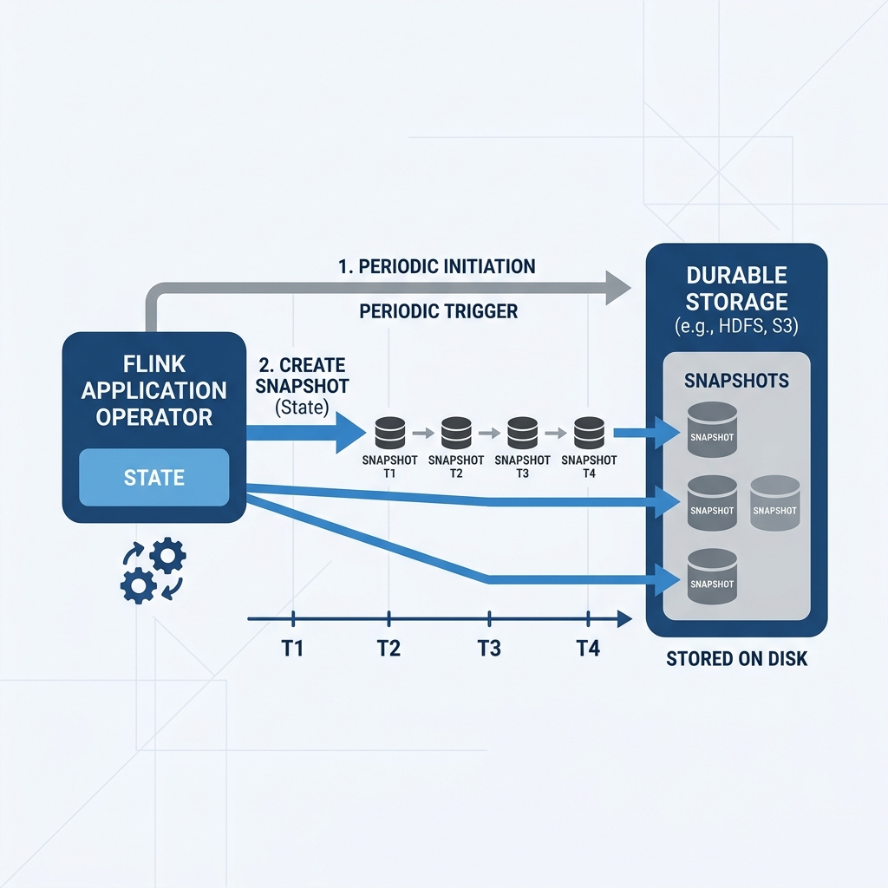

The secret to Flink's resilience is its ability to take "snapshots" of the entire cluster's state without stopping the data flow.

```java
// Configure exactly-once checkpoints every 1 minute
env.enableCheckpointing(60000);
env.getCheckpointConfig().setCheckpointingMode(CheckpointingMode.EXACTLY_ONCE);
env.getCheckpointConfig().setMinPauseBetweenCheckpoints(30000);
```

- **Checkpoints**: The "Auto-Save" feature. Automated, incremental snapshots for failure recovery.
- **Savepoints**: The "Manual Backup" feature. Portable snapshots used for code upgrades, cluster migrations, or A/B testing.

---

## 10. Alternatives to Apache Flink

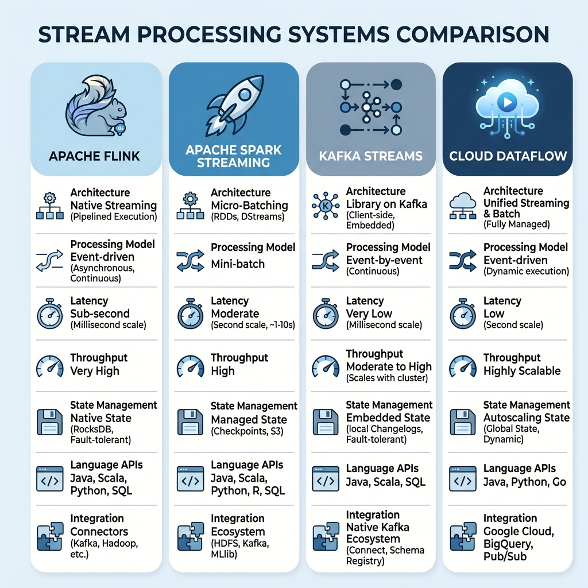

Flink is powerful, but other tools might fit your specific ecosystem:
- **Apache Spark Streaming**: Best if you are already deeply integrated with the Spark/Databricks batch ecosystem.
- **Kafka Streams**: Best for lightweight, library-based processing if your entire pipeline is within Kafka.
- **Cloud Dataflow**: The serverless, managed version of Apache Beam on Google Cloud.

---

## References & Further Learning

- [Apache Flink Documentation](https://flink.apache.org/documentation/)
- [Flink Hands-on Training](https://nightlies.apache.org/flink/flink-docs-stable/docs/learn-flink/introduction/)
- [ClickHouse Official Docs](https://clickhouse.com/docs/en)
- [Kafka Introduction](https://kafka.apache.org/intro)

---

Apache Flink transforms static data pipelines into dynamic, real-time intelligence engines, proving that complex event processing is accessible to everyone.
