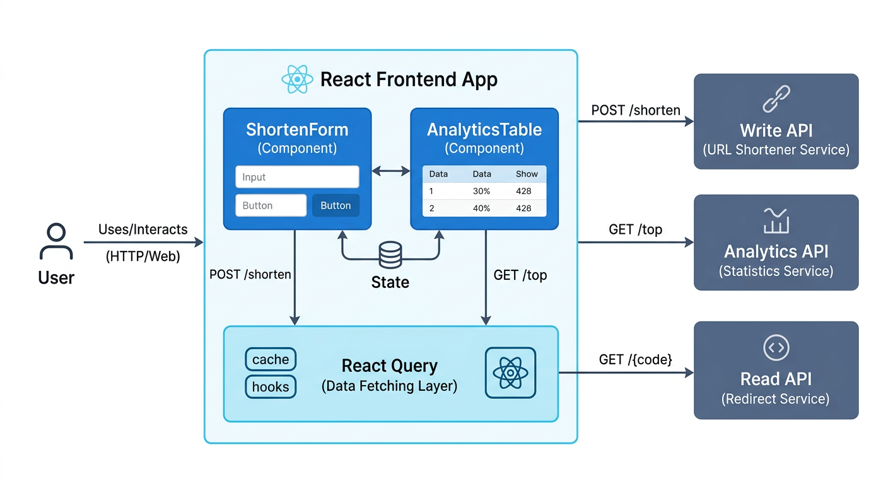

# HyperShort Frontend

A modern, high-performance URL shortener dashboard built with React, Tailwind CSS, and Shadcn UI.

## Architecture



## Features

- **URL Shortening**: Simple and intuitive interface for creating short URLs.
- **Link Management**: Edit destination URLs and delete links from your history dashboard.
- **Real-time Analytics**: Live dashboard showing top-performing links with click counts and destination URLs.
- **Dynamic Domain Support**: Automatically generates short URLs based on the configured base URL.
- **Responsive Design**: Optimized for desktop and mobile devices.
- **Optimized Data Fetching**: Uses `react-query` with a 5s refetch interval for near real-time updates.

## Tech Stack

- **Framework**: [React](https://reactjs.org/) + [Vite](https://vitejs.dev/)
- **Styling**: [Tailwind CSS](https://tailwindcss.com/)
- **UI Components**: [Shadcn UI](https://ui.shadcn.com/)
- **Icons**: [Lucide React](https://lucide.dev/)
- **Data Fetching**: [TanStack Query (React Query)](https://tanstack.com/query/latest)
- **Testing**: [Playwright](https://playwright.dev/)

## Local Development

### Prerequisites
- Node.js (v18+)
- npm

### Installation
```bash
cd frontend
npm install
```

### Running in Development
```bash
npm run dev
```
The app will be available at `http://localhost:10000`.

### Running Tests
```bash
# Run integration tests
npm run test

# Open Playwright report
npx playwright show-report
```

## Environment Variables

- `VITE_SHORT_LINK_BASE_URL`: The base URL used for generating short links (e.g., `http://localhost:10001`).
- `VITE_API_BASE_URL`: The base URL for the backend APIs (defaults to current host).
