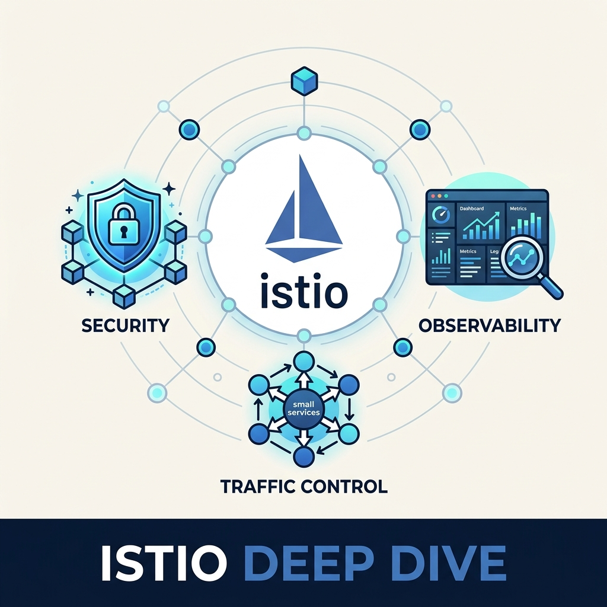
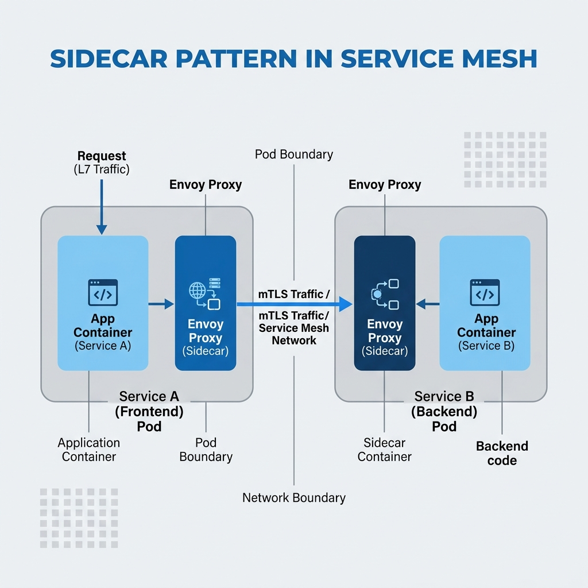
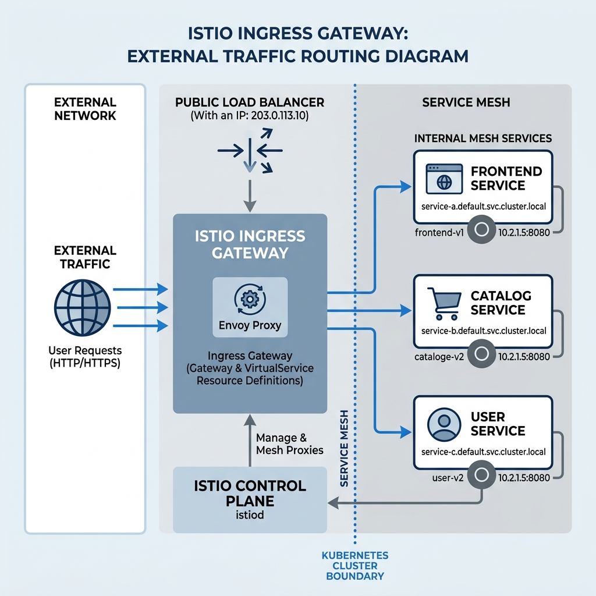
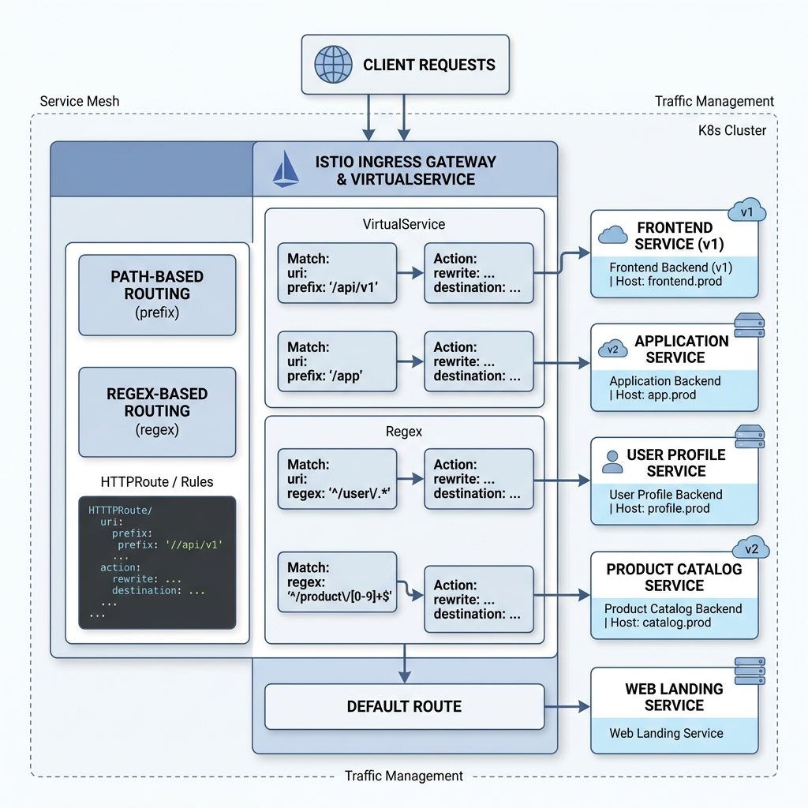
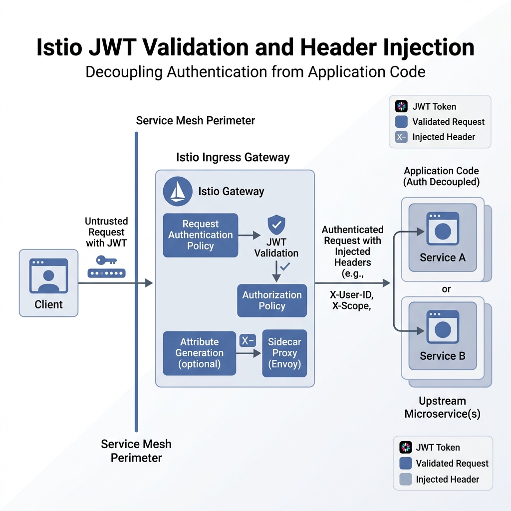
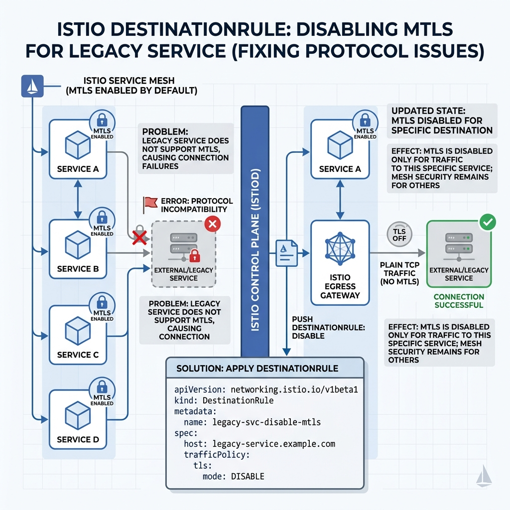
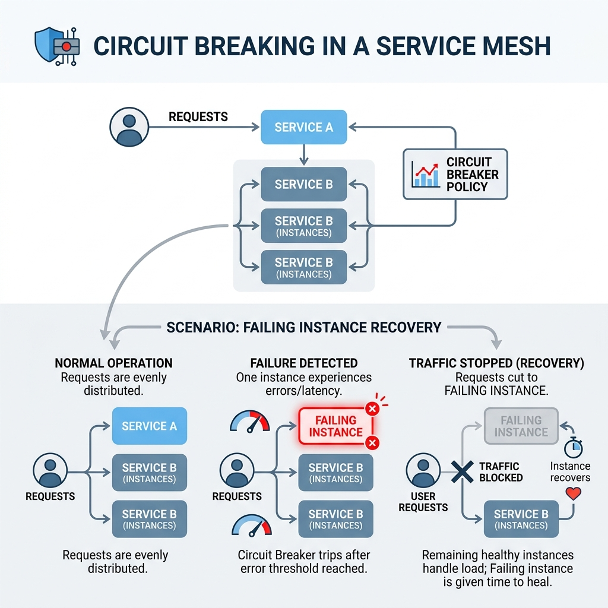
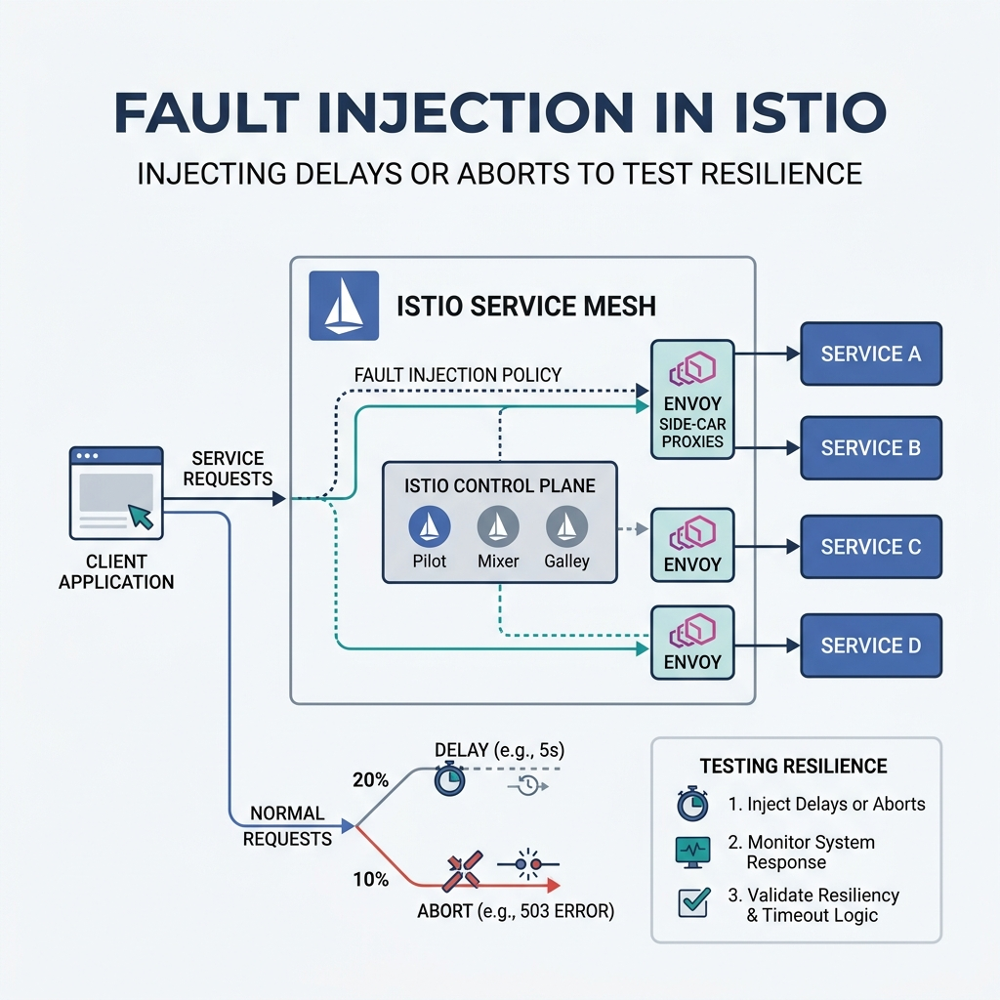
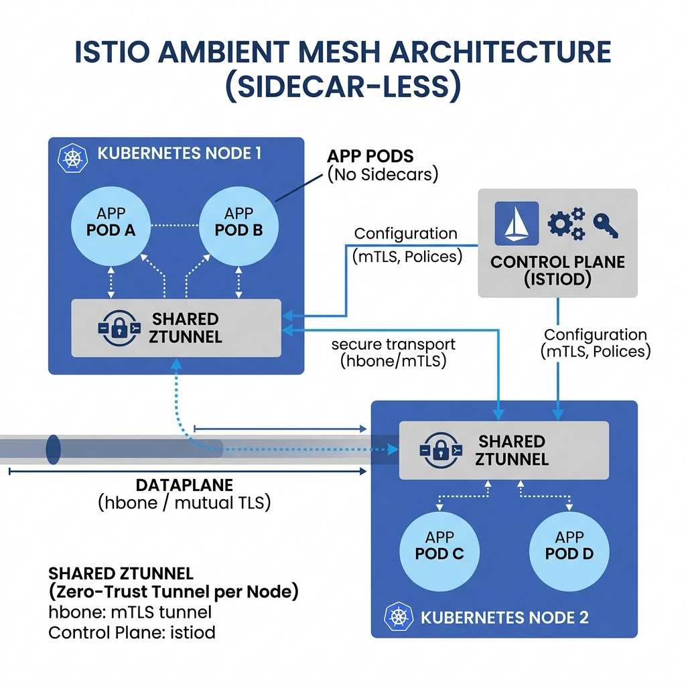

# Mastering Service Mesh: A Deep Dive into Istio with HyperShort



As systems evolve from simple monoliths to complex microservices, the "network" becomes the most critical—and often most fragile—component. Managing security, observability, and traffic control across dozens of services is a nightmare with traditional methods. Enter **Istio**.

In this guide, we use the **HyperShort URL Shortener** project as a live laboratory to explore how Istio solves these problems with declarative code.

---

## 1. Core Concept: The Sidecar Pattern

Istio doesn't ask your application to handle networking. Instead, it injects a tiny proxy (**Envoy**) next to every service.



**How it works in HyperShort:**
When the `write-api` wants to talk to the `spanner-emulator`, the request doesn't go over the wire directly. It goes:
`write-api` -> `istio-proxy (local)` -> `istio-proxy (remote)` -> `spanner-emulator`.

### Practice: Enabling the Mesh
We enabled this in our project with a single command in `run.sh`:
```bash
kubectl label namespace default istio-injection=enabled
```

---

## 2. North-South Traffic: The Istio Gateway

The Gateway describes a load balancer operating at the edge of the mesh receiving incoming or outgoing HTTP/TCP connections.



### Use Case: Multiple API Entry Points
HyperShort requires two entry points: Port 10000 for standard APIs and Port 10001 for high-speed redirects.

**The Implementation (`k8s/istio/gateways.yaml`):**
```yaml
apiVersion: networking.istio.io/v1alpha3
kind: Gateway
metadata:
  name: main-gateway
  namespace: istio-system
spec:
  selector:
    istio: ingressgateway
  servers:
  - port:
      number: 8080 # Matches the containerPort of the Ingress pod
      name: http
      protocol: HTTP
    hosts:
    - "*"
```

---

## 3. Intelligent Routing: VirtualServices

A `VirtualService` defines the rules that control how requests for a service are routed within an Istio service mesh.

### Use Case: Path-Based Routing & Regex
We need to route `/api/v1/shorten` to the `write-api`, but any single-segment slug (like `/my-cool-link`) must go to the `read-api`.



**The Implementation (`k8s/istio/virtual-services.yaml`):**
```yaml
http:
- match:
  - uri:
      prefix: /api/v1/shorten
  route:
  - destination:
      host: write-api.default.svc.cluster.local
      port:
        number: 80
- match:
  - uri:
      regex: "^/[a-zA-Z0-9-_]+$" # Match the URL slug
  route:
  - destination:
      host: read-api.default.svc.cluster.local
      port:
        number: 80
```

---

## 4. Zero-Trust Security: JWT & Authorization

Istio handles authentication at the infrastructure layer. Your application code never has to parse a JWT again.



### Use Case: Extracting User Identity
HyperShort needs to know *who* is shortening a URL to provide history. 

**The Implementation (`k8s/istio/auth.yaml`):**
```yaml
apiVersion: security.istio.io/v1beta1
kind: RequestAuthentication
spec:
  jwtRules:
  - issuer: "https://securetoken.google.com/gen-lang-client-0131917105"
    forwardOriginalToken: true
    outputClaimToHeaders:
    - header: "X-User-Id" # The app just reads this header!
      claim: "sub"
```

---

## 5. Advanced Resilience: Solving gRPC Protocol Issues

When a service mesh intercepts traffic, it expects valid protocols. In HyperShort, our `write-api` failed to connect to the Spanner Emulator because of missing gRPC headers.

### The Fix: DestinationRules
We used a `DestinationRule` to tell Istio exactly how to handle traffic to the emulator, specifically disabling mTLS which was interfering with the emulator's simple HTTP/2 bridge.



```yaml
apiVersion: networking.istio.io/v1alpha3
kind: DestinationRule
metadata:
  name: spanner-emulator-dr
spec:
  host: spanner-emulator.default.svc.cluster.local
  trafficPolicy:
    tls:
      mode: DISABLE # Bypass mesh encryption for this internal tool
```

---

## 6. Advanced Industry Standard Usage

Beyond what we implemented in HyperShort, Istio is used for high-end engineering requirements:

### A. Circuit Breaking
If the `analytics-api` starts failing, Istio can "trip the circuit" and stop sending traffic to it, allowing it to recover instead of being hammered by retries.


```yaml
trafficPolicy:
  outlierDetection:
    consecutive5xxErrors: 5
    interval: 30s
    baseEjectionTime: 1m
```

### B. Fault Injection
You can "inject" a 5-second delay into 10% of requests to test if your frontend handles slowness gracefully.


```yaml
http:
- fault:
    delay:
      percentage:
        value: 10.0
      fixedDelay: 5s
  route:
  - destination:
      host: read-api
```

### C. Ambient Mesh (Sidecar-less)
The industry is moving toward **Istio Ambient Mesh**, which uses a shared "ztunnel" on each node instead of a sidecar in every pod. This reduces memory usage by up to 70%.



---

## Conclusion: Why Istio Wins

By migrating HyperShort to Istio, we achieved:
1.  **Security**: Automatic mTLS and JWT validation.
2.  **Control**: Fine-grained regex routing at the edge.
3.  **Observability**: Instant tracing and metrics without code changes.
4.  **Clean Code**: The backend services now focus purely on logic, not networking.

**HyperShort is now a battle-ready, mesh-enabled system.**

---
*Authored by: HyperShort Engineering*
*Project: URL Shortener Evolution*
