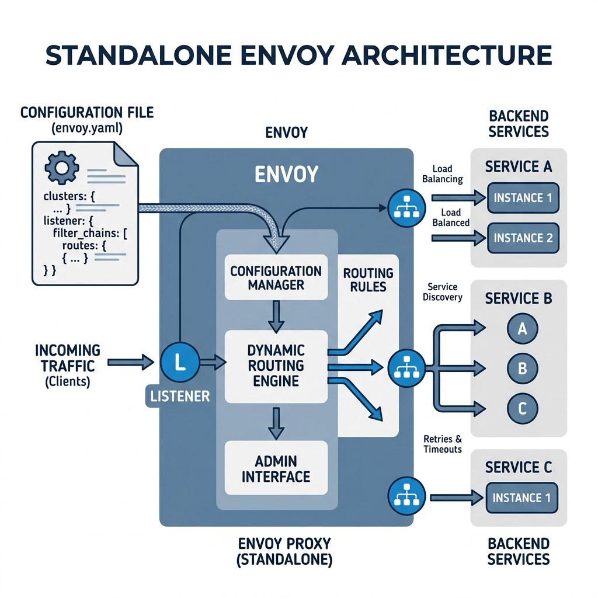
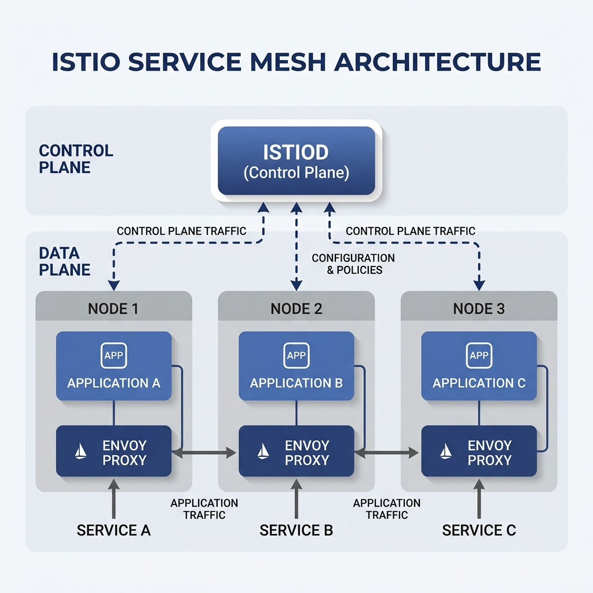
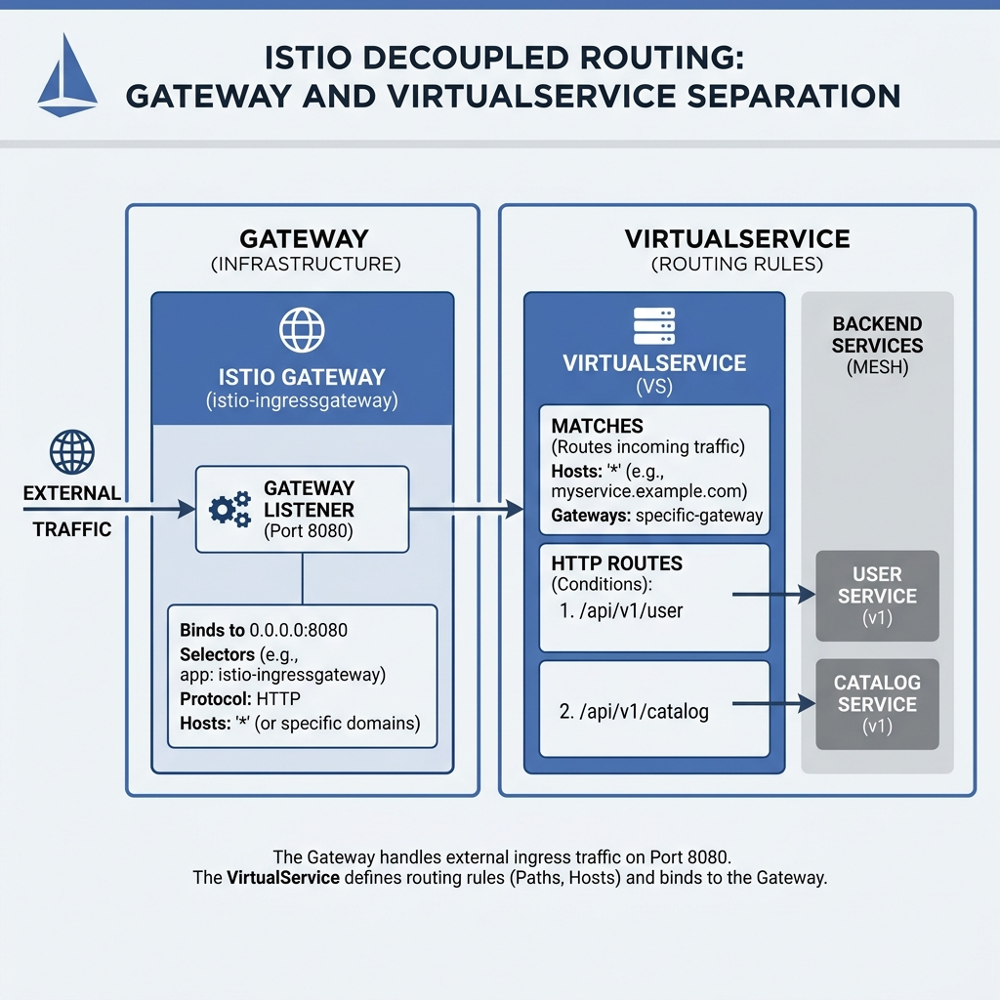
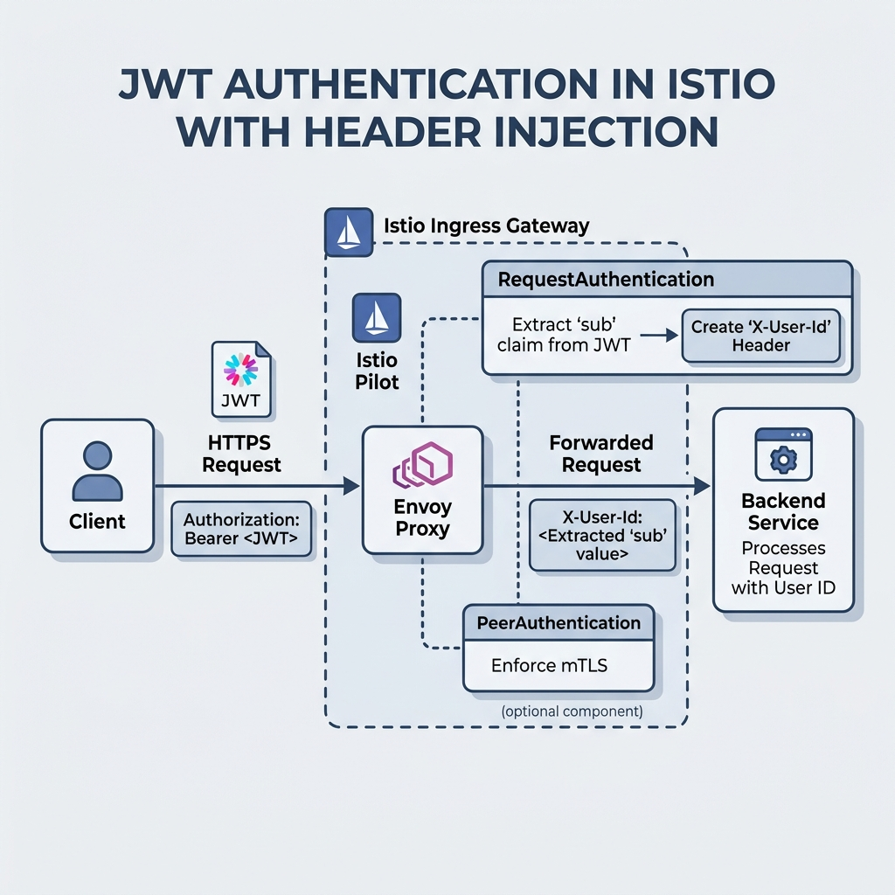
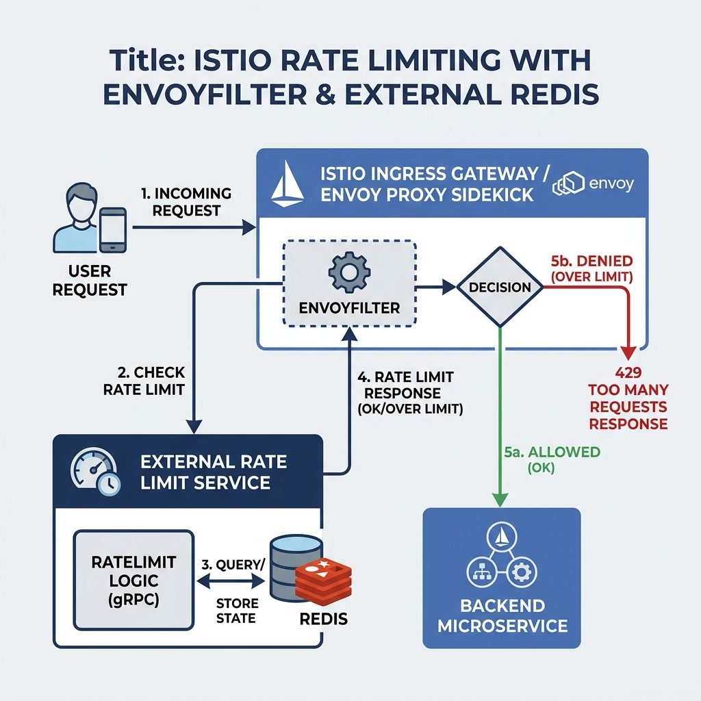
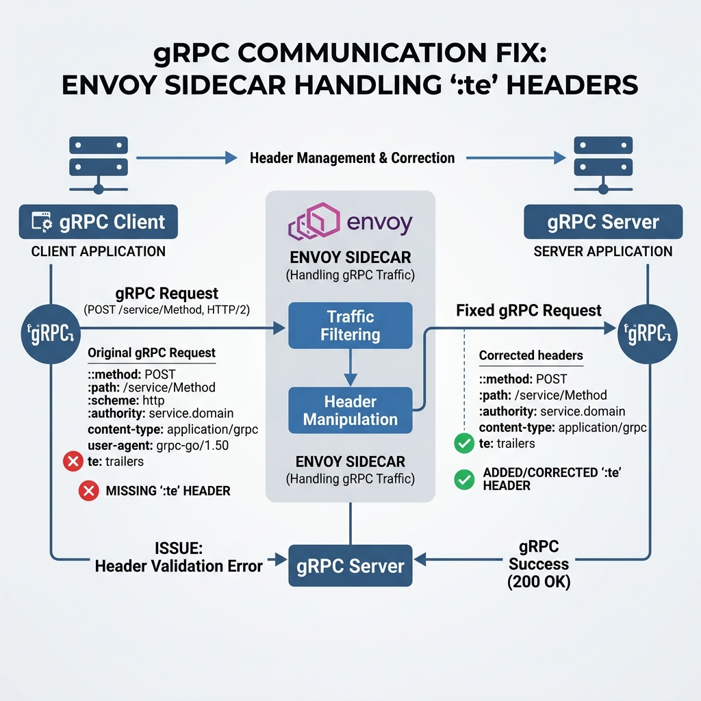
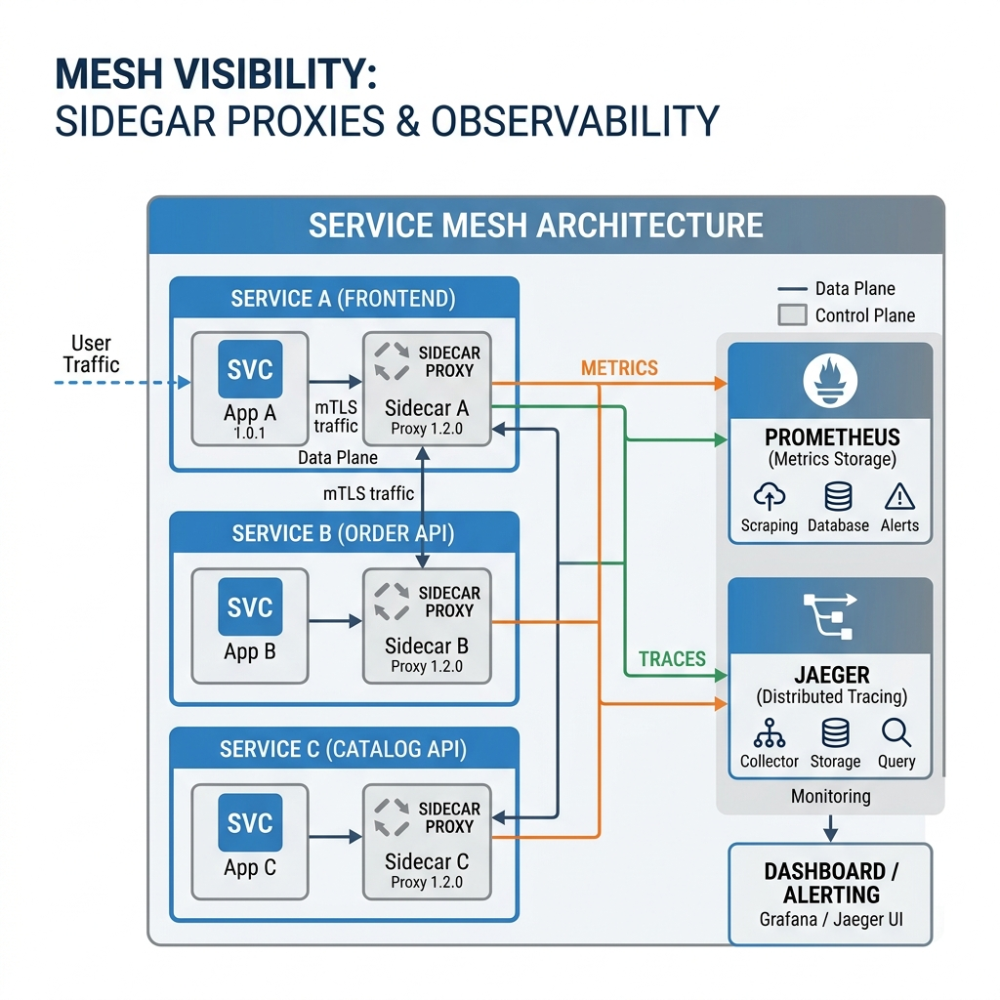

# Blog: From Static Proxies to Service Mesh
## Migrating HyperShort from Standalone Envoy to Istio

The journey of scaling a high-performance system like **HyperShort** often leads to a crossroads: continue managing complex, static configuration files for sidecars and gateways, or embrace a managed Service Mesh. Today, we’re documenting our successful migration from a standalone Envoy Proxy setup to **Istio**.

---

### 1. The Architecture Shift: Before and After

#### The Standalone Envoy Era
In our original setup, Envoy acted as a rigid gatekeeper. We manually managed a ~300 line `envoy.yaml` ConfigMap. Every change required a pod restart, and observability was "opt-in" per service.

**Architecture Diagram: Standalone Envoy**


#### The Istio Service Mesh Era
With Istio, the network becomes a first-class citizen. Envoy still does the heavy lifting, but it's now managed by the **Istio Control Plane (istiod)**. Features like mTLS, telemetry, and complex routing are now defined via high-level Kubernetes CRDs.

**Architecture Diagram: Istio Mesh**


---

### 2. Replacing the Gateway: Routing Logic

**Envoy Implementation:**
We had a complex `route_config` with virtual hosts matching ports 10000 and 10001. Path matching was handled via explicit regex in the Envoy YAML.

**Istio Replacement:**
We decoupled the **Gateway** (the listener) from the **VirtualService** (the logic). 

**Visualizing Decoupled Routing**


```yaml
# Istio Gateway replaces the Envoy Listener
apiVersion: networking.istio.io/v1alpha3
kind: Gateway
metadata:
  name: main-gateway
  namespace: istio-system
spec:
  selector:
    istio: ingressgateway
  servers:
  - port:
      number: 8080 
      name: http
      protocol: HTTP
    hosts:
    - "*"
```

**The Benefit:** We no longer need to manage the underlying Envoy listeners manually. If we want to add HTTPS, we simply update the Gateway CRD, and Istio pushes the certificates to Envoy dynamically.

---

### 3. Identity and Security: JWT Authentication

**Envoy Implementation:**
We used the `envoy.filters.http.jwt_authn` filter. It was tightly coupled to the routing configuration, making it hard to apply globally.

**Istio Replacement:**
We used **RequestAuthentication**. This separates the "How to validate a token" from "Where to enforce it."

**JWT Claim Extraction Flow**


```yaml
apiVersion: security.istio.io/v1beta1
kind: RequestAuthentication
metadata:
  name: google-jwt
  namespace: istio-system
spec:
  selector:
    matchLabels:
      istio: ingressgateway
  jwtRules:
  - issuer: "https://securetoken.google.com/..."
    audiences:
    - "gen-lang-client-0131917105"
    jwksUri: "https://www.googleapis.com/..."
    forwardOriginalToken: true
    outputClaimToHeaders:
    - header: "X-User-Id"
      claim: "sub"
```

**The Benefit:** Zero code changes in our Go backend. Istio extracts the `sub` claim and injects it as an `X-User-Id` header. Our `write-api` simply reads the header, completely oblivious to the fact that it was originally a JWT.

---

### 4. Traffic Control: Rate Limiting

**Envoy Implementation:**
We used both `local_ratelimit` for immediate protection and `ratelimit` (global) for distributed limits.

**Istio Replacement:**
While Istio has its own high-level APIs, we used **EnvoyFilter** for a surgical migration. This allowed us to keep our existing Redis-based Global Rate Limit service while Istio managed the injection.

**Distributed Rate Limiting Diagram**


```yaml
apiVersion: networking.istio.io/v1alpha3
kind: EnvoyFilter
metadata:
  name: local-rate-limit
  namespace: istio-system
spec:
  configPatches:
  - applyTo: HTTP_FILTER
    match:
      context: GATEWAY
    patch:
      operation: INSERT_BEFORE
      value:
        name: envoy.filters.http.local_ratelimit
        typed_config:
          "@type": type.googleapis.com/...LocalRateLimit
          token_bucket:
            max_tokens: 1000
            tokens_per_fill: 1000
```

**The Benefit:** We kept the robustness of Envoy's rate limiting but gained the ability to apply it to *any* service in the mesh with a single YAML apply, rather than editing individual sidecar configs.

---

### 5. Solving the "gRPC Header" Mystery

During migration, we hit a critical wall: `Missing :te header` errors when `write-api` talked to the Spanner Emulator. 

**The Discovery:**
Istio’s sidecar proxy is strict. When it intercepts gRPC traffic, it expects standard gRPC headers. Some emulators or older gRPC clients don't send the `:te` (transport encoding) header that Envoy expects when acting as an HTTP/2 bridge.

**The Fix:**
We used Istio's namespace labeling to selectively disable injection for the Spanner Init pod and used a `DestinationRule` to handle the emulator traffic properly.

**gRPC Interception Fix**


---

### 6. The "Mesh" Benefits Realized

1.  **Observability Out-of-the-Box**: By simply adding the sidecars, we now get distributed tracing (Jaeger) and metrics (Prometheus/Grafana) for every single hop in the system.
2.  **Mutual TLS (mTLS)**: Every connection between `write-api`, `read-api`, and `analytics-api` is now encrypted automatically.
3.  **Resilience**: We can now implement retries, timeouts, and circuit breakers via `VirtualService` configurations.

**Full Mesh Visibility**


### Conclusion

Migrating from Envoy to Istio moved us from **imperative infrastructure** to **declarative intent**. HyperShort is now Mesh-Native, ready to scale with full confidence in our network reliability and security.

---

*Authored by: HyperShort Engineering Team*
*Date: March 28, 2026*
